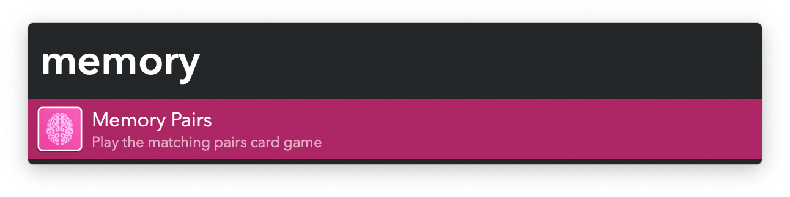
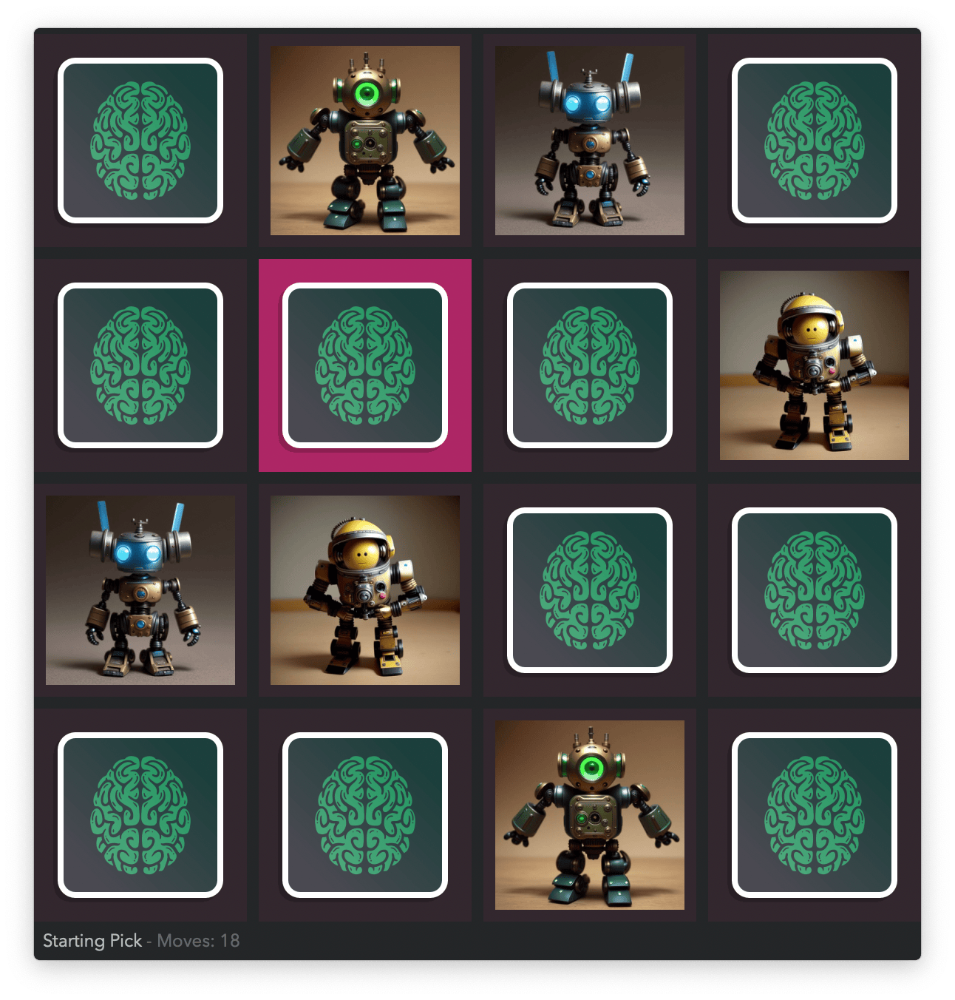

## Usage

Play the [matching pairs game](https://en.wikipedia.org/wiki/Concentration_%28card_game%29) via the `memory` keyword.

* <kbd>↩</kbd> Reveal card.
* <kbd>⌘</kbd><kbd>↩</kbd> Start new game.

Increase the difficulty and change the set of images in the Workflow’s Configuration.
