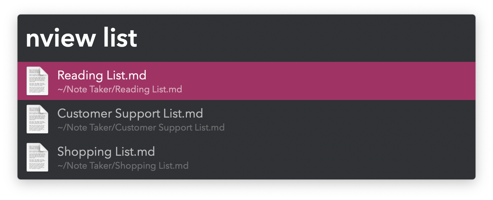
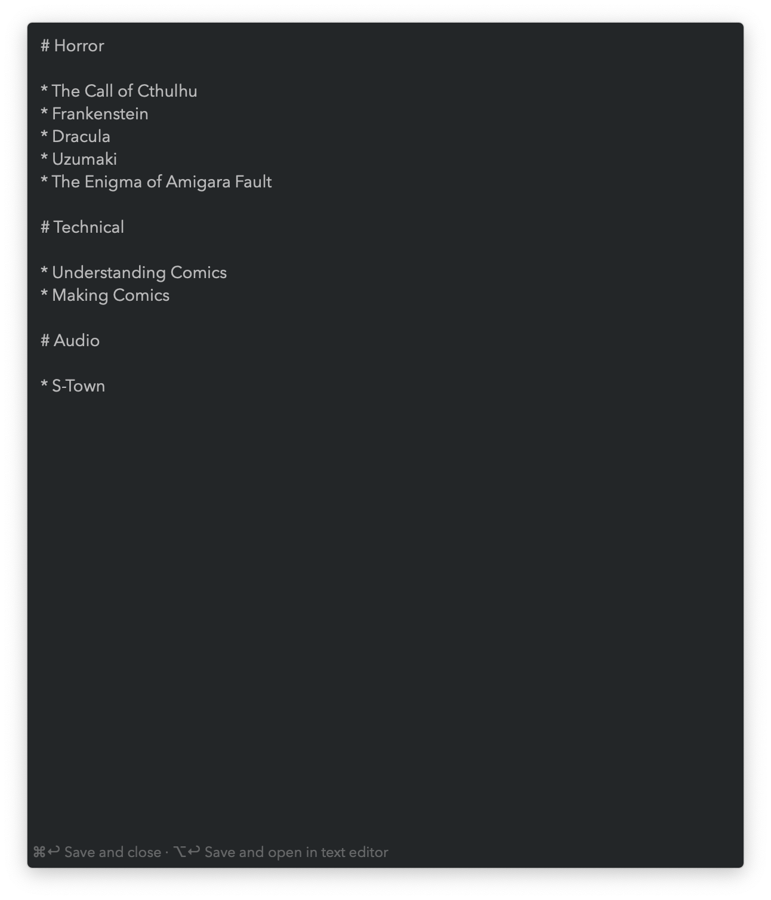
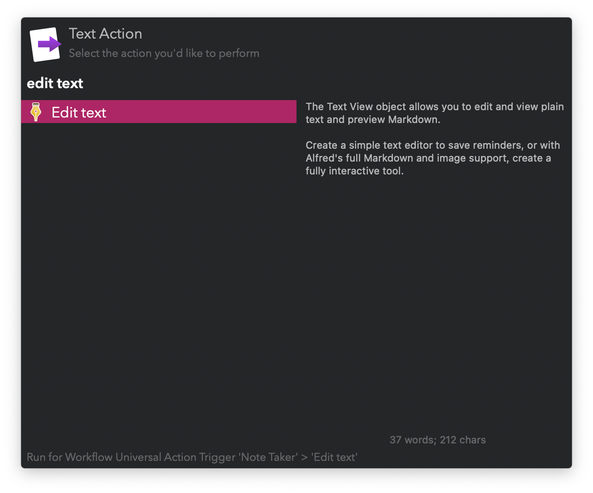
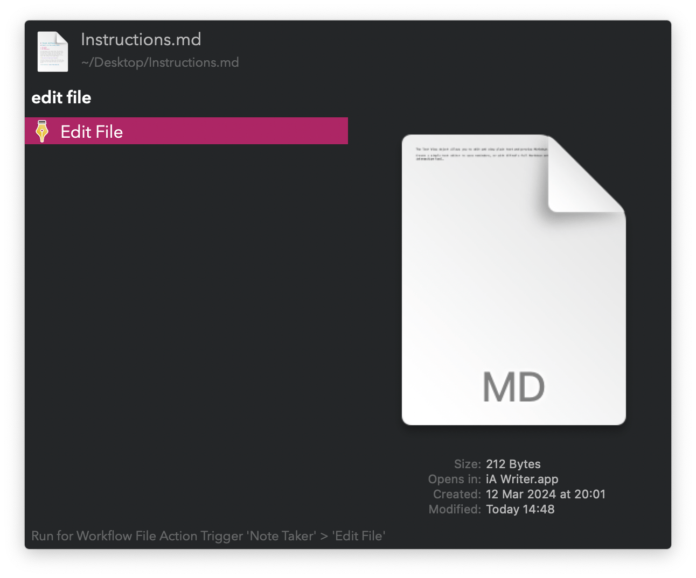
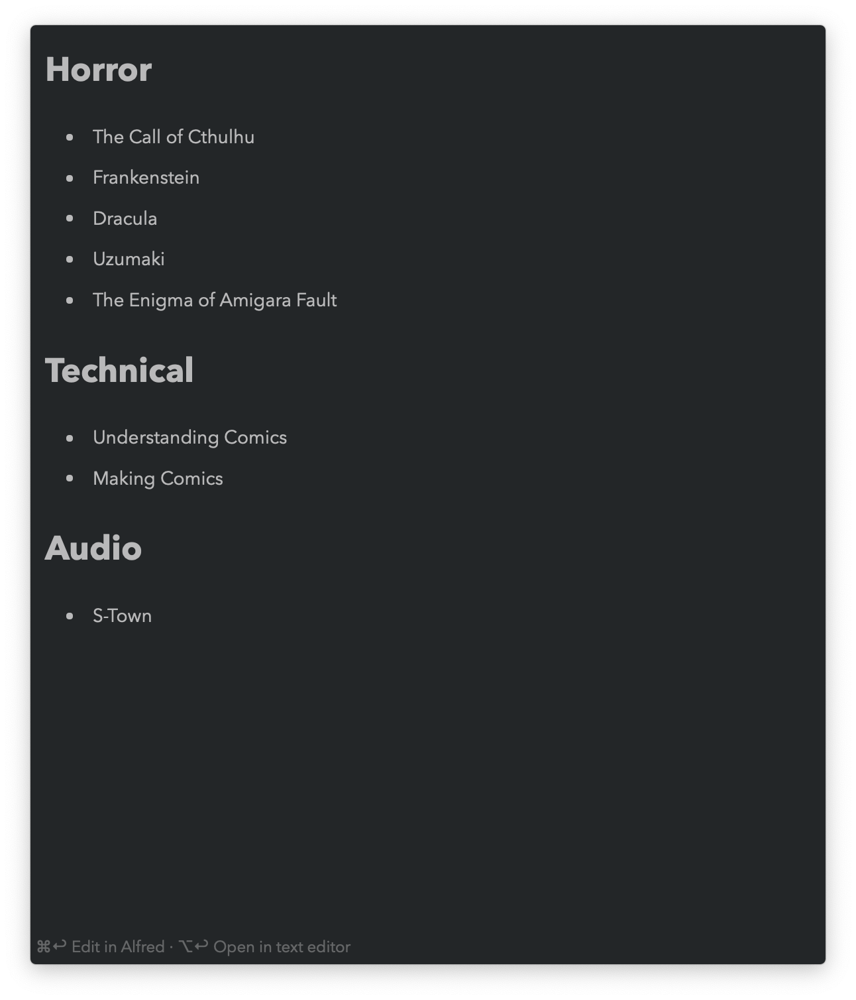

## Usage

### Create

Make new notes via the `nadd` keyword. Type a name and press <kbd>↩</kbd> to open the file for editing.

Alternatively, create a new note from a selection or Clipboard History with the Universal Action.

### Search

Find your notes with the `nview` keyword.

* <kbd>↩</kbd> Edit note.
* <kbd>⌘</kbd><kbd>↩</kbd> Preview note in Alfred, parsing markdown.
* <kbd>⌥</kbd><kbd>↩</kbd> Copy note contents.
* <kbd>⌃</kbd><kbd>↩</kbd> Copy note contents and delete it.
* <kbd>⌘</kbd><kbd>Y</kbd> Quick Look note.

## Edit

Notes can be edited directly in Alfred or a text editor. The default can be changed in the Workflow’s Configuration. Alfred’s view is stacked, meaning <kbd>⎋</kbd> goes back to the search. <kbd>⌘</kbd><kbd>⎋</kbd> force hides.

* <kbd>⌘</kbd><kbd>↩</kbd> Save note.
* <kbd>⌥</kbd><kbd>↩</kbd> Save and open in text editor.

With the Universal Actions, edit text from a file, a selection, or Clipboard History.

### Preview

Notes previewed in Alfred are parsed as markdown. The view is stacked, meaning <kbd>⎋</kbd> goes back to the search. <kbd>⌘</kbd><kbd>⎋</kbd> force hides.

* <kbd>⌘</kbd><kbd>↩</kbd> Edit note in Alfred.
* <kbd>⌥</kbd><kbd>↩</kbd> Open in text editor.
