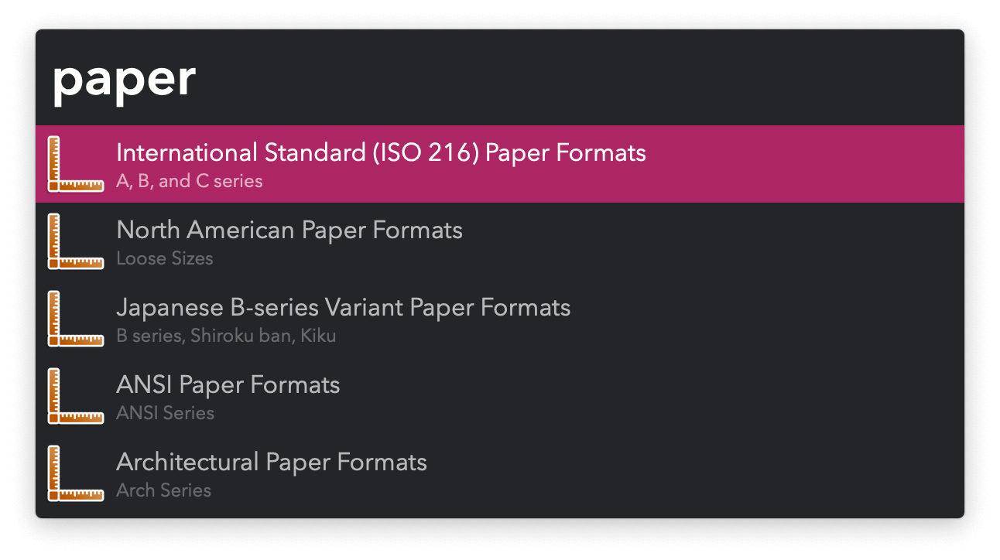
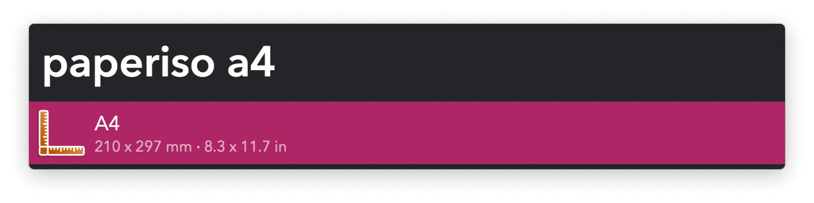

## Usage

Reference international paper formats via the keywords:

* `paperiso` International Standard (ISO 216) Paper Formats.
* `paperna` North American Paper Formats.
* `paperjis` Japanese B-series Variant Paper Formats.
* `paperansi` ANSI Paper Formats.
* `paperarch` Architectural Paper Formats.

Keywords can be customised in the Workflow’s Configuration, as well as the sizes (millimetres or inches) to copy when pressing <kbd>↩</kbd> (default format) or <kbd>⌥</kbd><kbd>↩</kbd> (alternative format).
