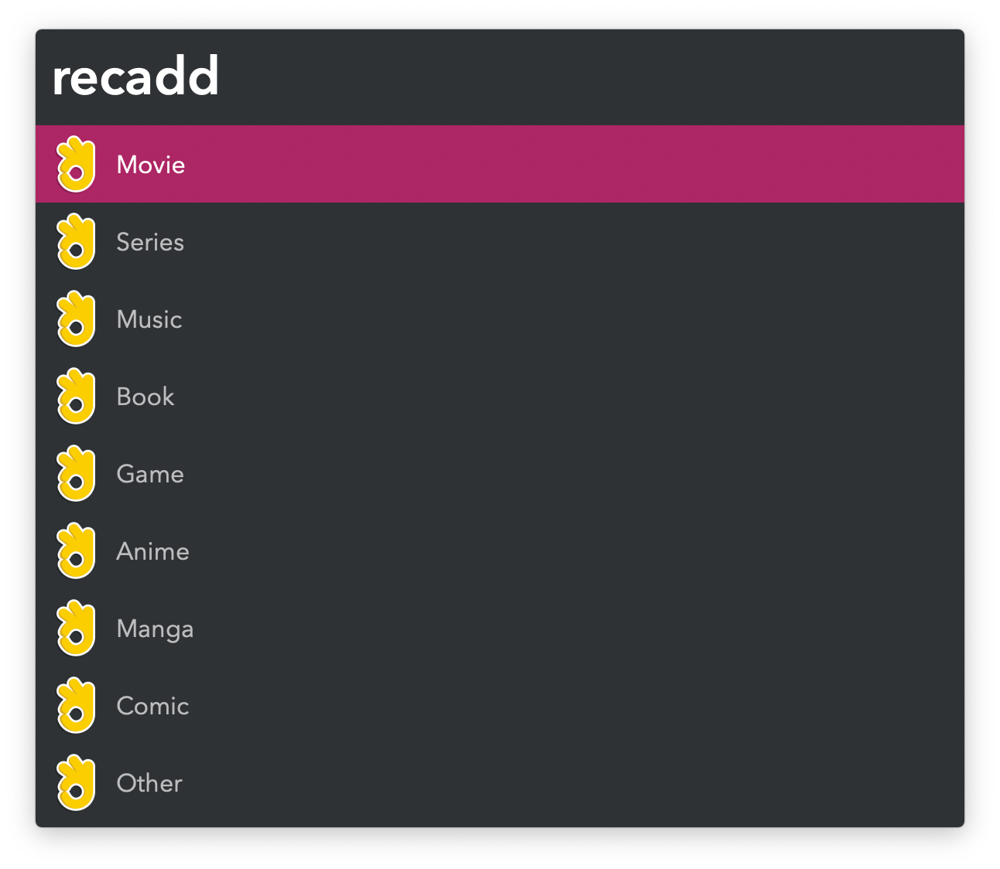
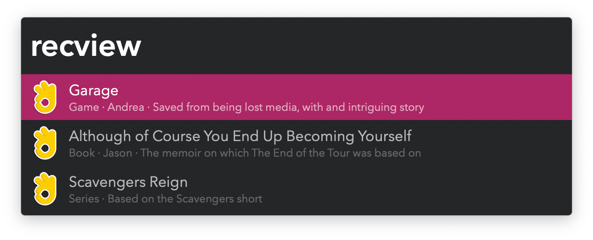

## Usage

Add movies, music, books, games, and more to a list via the `recadd` keyword. A category and title are required, but the recommender and why it was iteresting to you are optional.

Search through your list with the `recview` keyword.

* <kbd>↩</kbd> Open a search for the recommendation. Define preferred websites for each category in the Workflow’s Configuration.
* <kbd>⌘</kbd><kbd>↩</kbd> Delete recommendation.
* <kbd>⌥</kbd><kbd>↩</kbd> Edit recommendation.
