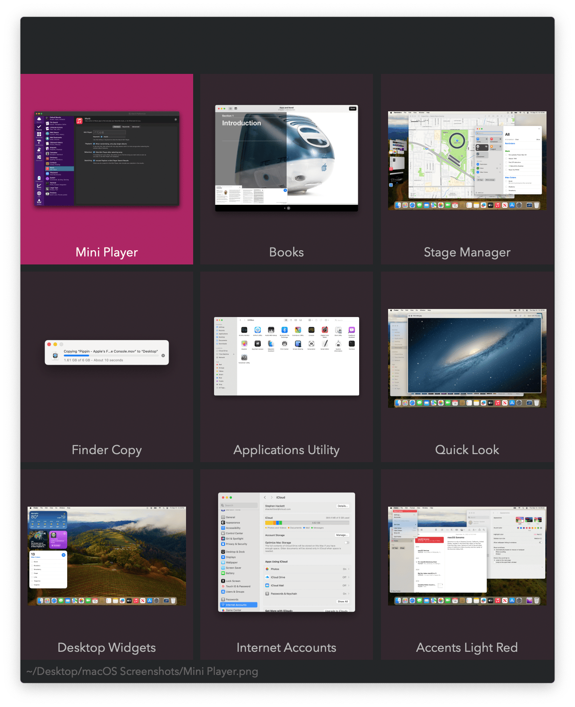
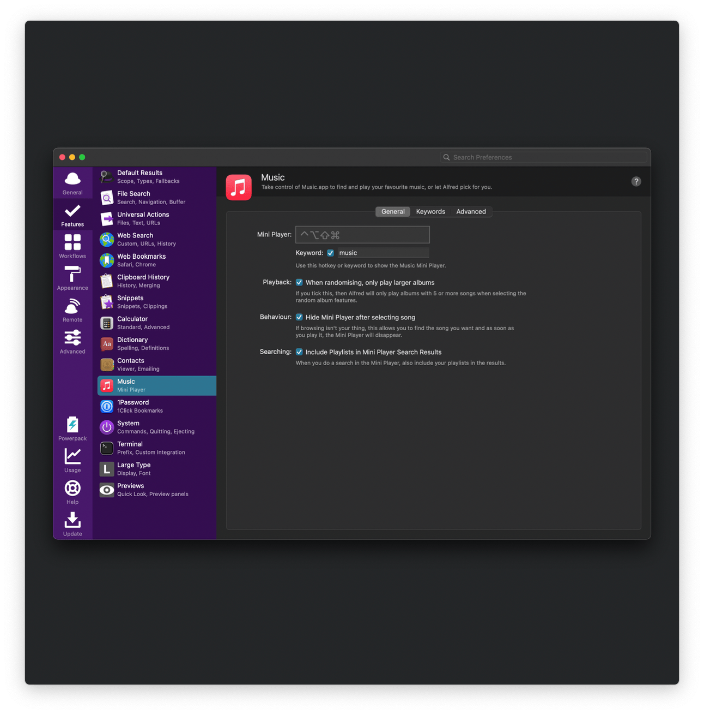
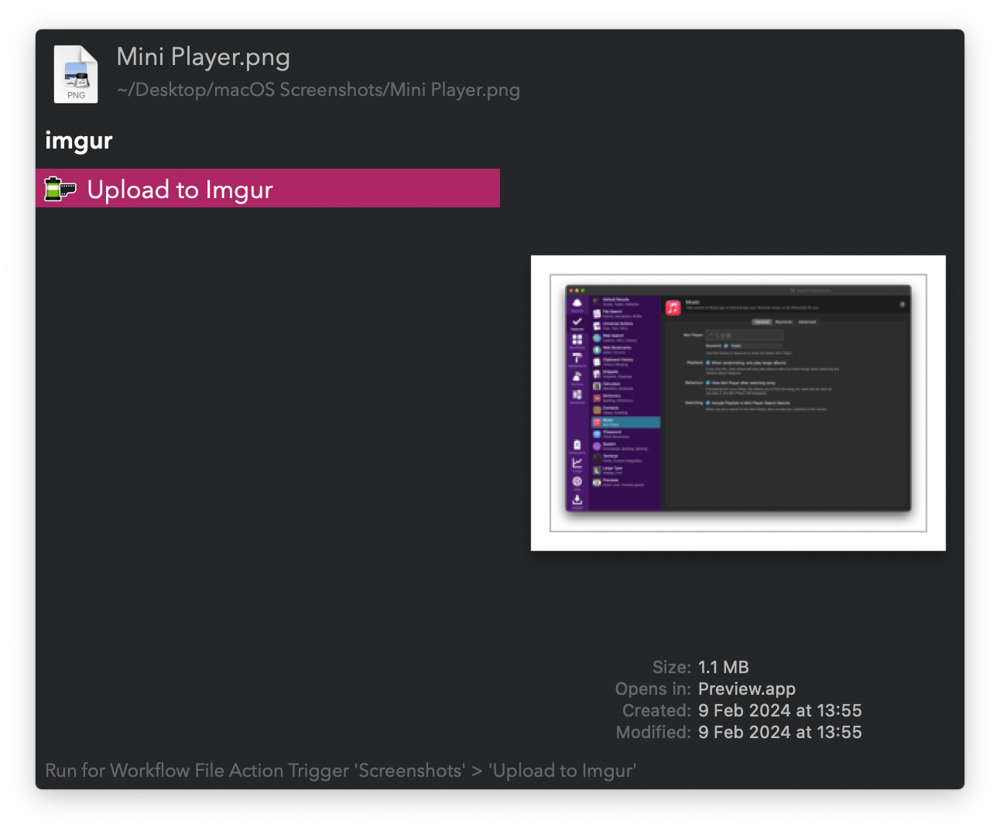
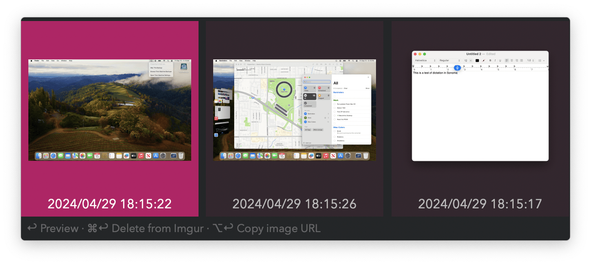

## Usage

### Files

Search screenshots via the `screenshots` keyword.

* <kbd>↩</kbd> View in Alfred.
* <kbd>⌘</kbd><kbd>↩</kbd> Copy to clipboard.
* <kbd>⌥</kbd><kbd>↩</kbd> Reveal in Finder.
* <kbd>⌃</kbd><kbd>↩</kbd> Rerun search with Optical Character Recognition on images.
* <kbd>⇧</kbd><kbd>↩</kbd> Upload to [Imgur](https://imgur.com).

* <kbd>↩</kbd> Show compatible apps for opening.
* <kbd>⌘</kbd><kbd>↩</kbd> Copy to clipboard.
* <kbd>⌥</kbd><kbd>↩</kbd> Reveal in Finder.
* <kbd>⇧</kbd><kbd>↩</kbd> Upload to [Imgur](https://imgur.com).
* <kbd>⎋</kbd> Return to Grid View.

### Clipboard

View clipboard images via the `clipimg` keyword. The same actions as searching files apply.

### Web

Take an interactive screenshot and upload it to Imgur via the `imgur` keyword. This requires [getting an API client ID](https://api.imgur.com/oauth2/addclient) and adding it in the Workflow’s Configuration.

Alternatively, upload any image with the Universal Action.

View uploaded images with <kbd>⌥</kbd><kbd>↩</kbd> in the `imgur` keyword.

* <kbd>↩</kbd> View in Alfred.
* <kbd>⌘</kbd><kbd>↩</kbd> Delete from Imgur.
* <kbd>⌥</kbd><kbd>↩</kbd> Copy image URL.
