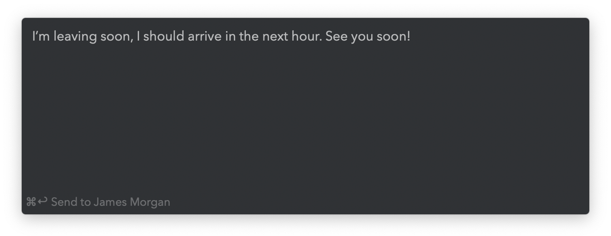
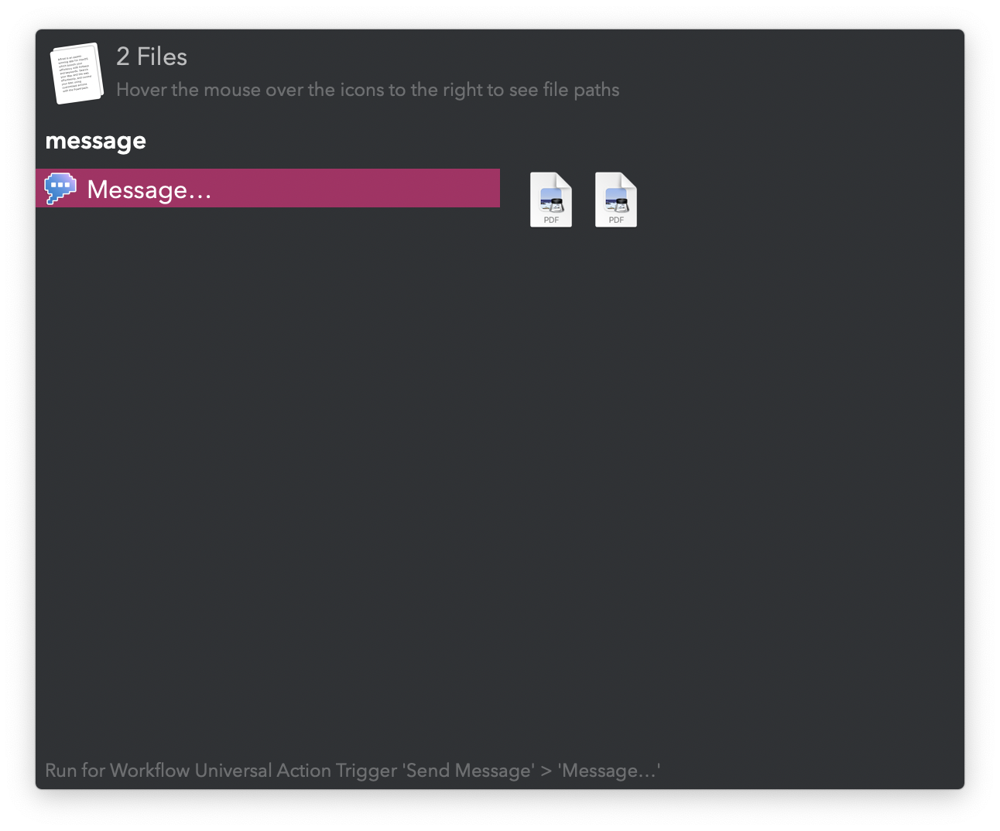
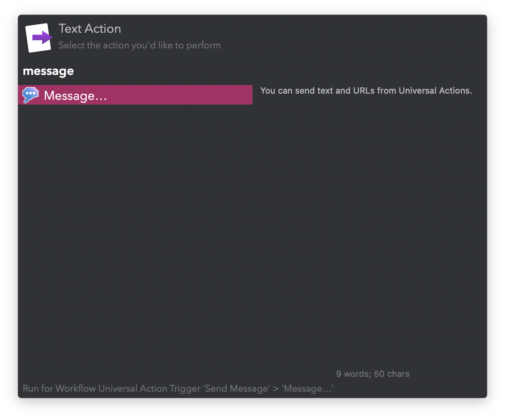

## Usage

Write and send a message to an ongoing conversation in Messages via the `message` keyword.

Send URLs, files, and text from a selection or Clipboard History with the Universal Actions.

