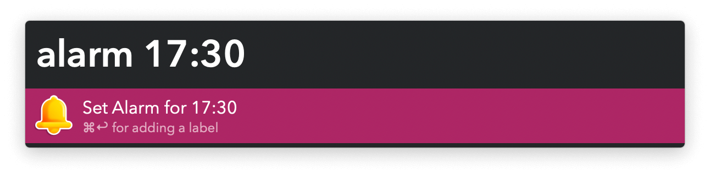
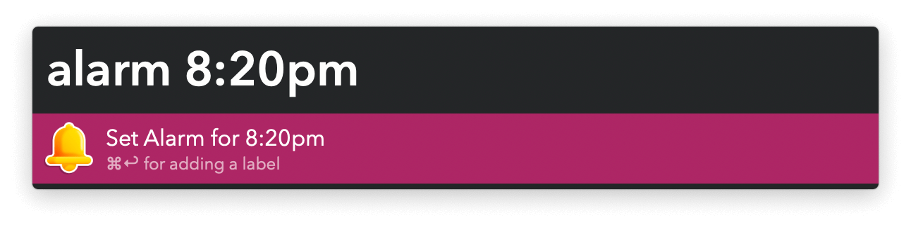

## Usage

Set a timer via the `timer` keyword followed by a number. Minutes are the default but you can specify hours or seconds.

Set an alarm via the `alarm` keyword followed by a time.

Pressing <kbd>⌘</kbd><kbd>↩</kbd> allows setting a name for the alarm.

Edit alarms and timers in the macOS Clock app.
