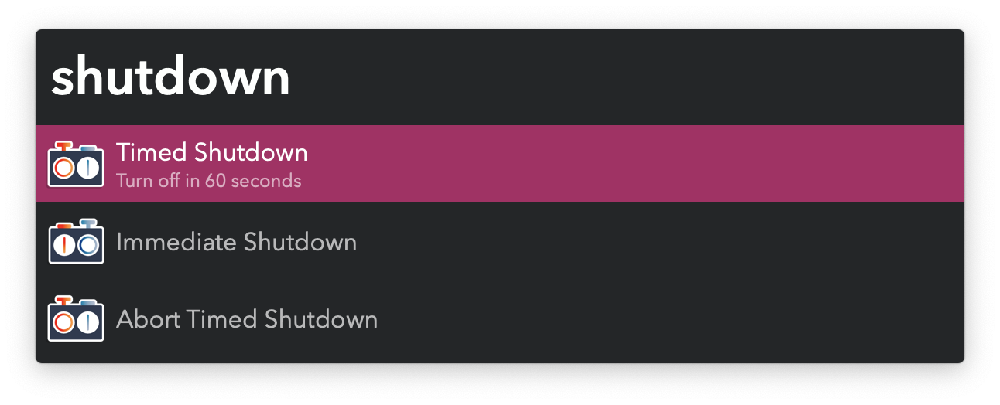

## Usage

Turn off your Mac on a timer via the `shutdown` keyword. Large Type will show periodically with the remaining time.

Stop an ongoing timer with `shutdown abort`.

Configure the timer in the Workflow’s Configuration.

To trigger an immediate shutdown or restart, use the `shutdown` or `restart` keywords.
