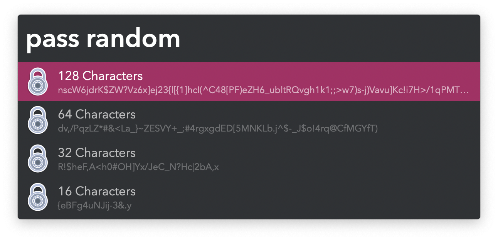
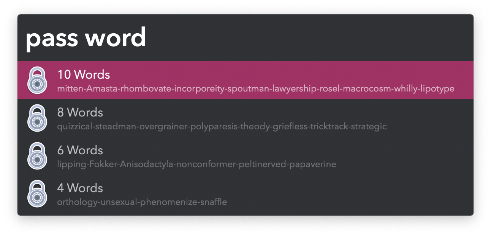

## Usage

Generate a set of random character passwords via the `pass random` keyword.

* <kbd>↩</kbd> Copy password with special characters.
* <kbd>⌘</kbd><kbd>↩</kbd> Copy password without special characters.

Generate a set of word-based passwords via the `pass word` keyword.

* <kbd>↩</kbd> Copy password.
