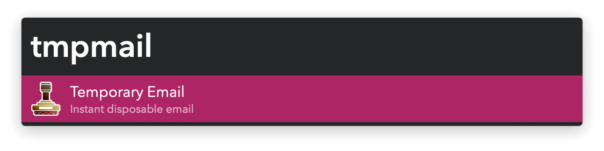

## Usage

Create a temporary email address via the `tmpmail` keyword. A random inbox name is used unless you type one.

On supported web browsers, the email inbox will open in a background tab and the address pasted to the current input field.
