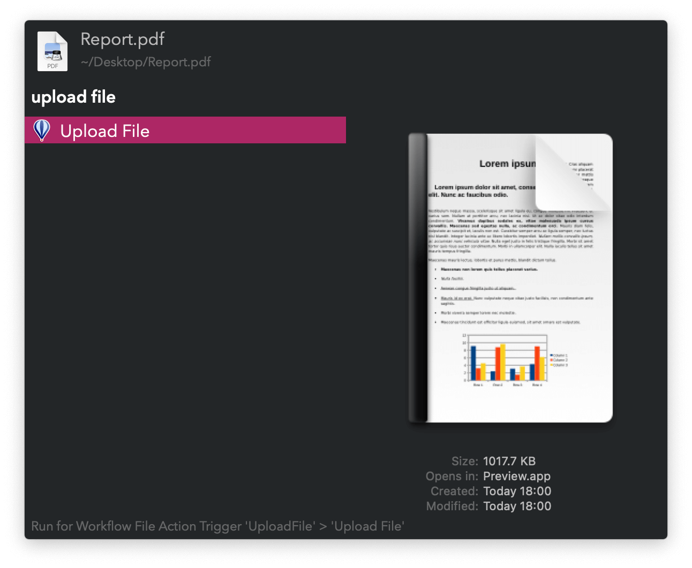

## Usage

Upload files and folders via the Universal Action. Folders and multiple files are zipped prior to upload.

When done, the download link is copied to the clipboard. Check upload progress via the `ufp` keyword.

* <kbd>⌘</kbd><kbd>↩</kbd> Cancel upload.
