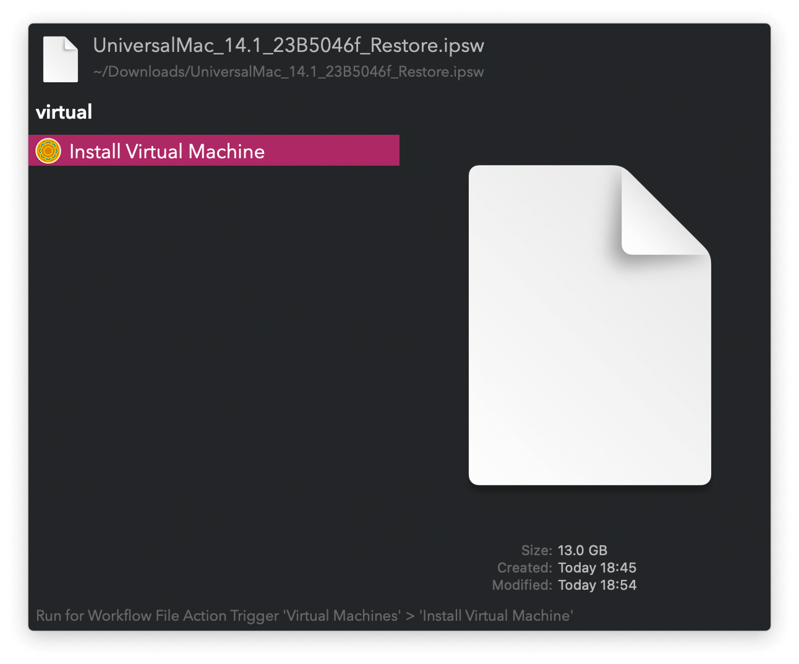

## Setup

Install [`tart`](https://github.com/cirruslabs/tart) with `brew install cirruslabs/cli/tart` and use it to install your virtual machines. You can install Apple Device Software Update Files (`.ipsw`) via the Universal Action.

## Usage

Search installed virtual machines via the `tart` keyword. List VMs ignored from the main list with the `itart` keyword.

* <kbd>↩</kbd> Run virtual machine.
* <kbd>⌘</kbd><kbd>↩</kbd> Toggle perishable run (a clone is created, started, and deleted on exit).
* <kbd>⌥</kbd><kbd>↩</kbd> Clone. <kbd>⌘</kbd><kbd>↩</kbd> when naming to start the new one.
* <kbd>⌃</kbd><kbd>↩</kbd> Delete.
* <kbd>⇧</kbd><kbd>↩</kbd> Toggle ignore.
* <kbd>fn</kbd><kbd>↩</kbd> Switch between Main and Ignored lists.
