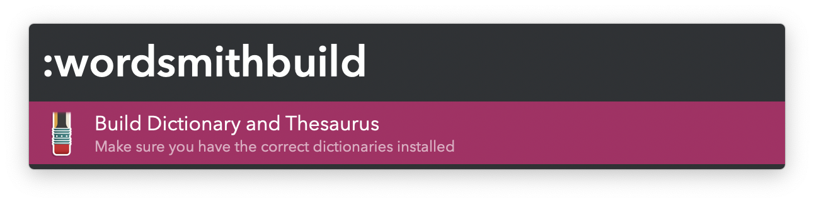
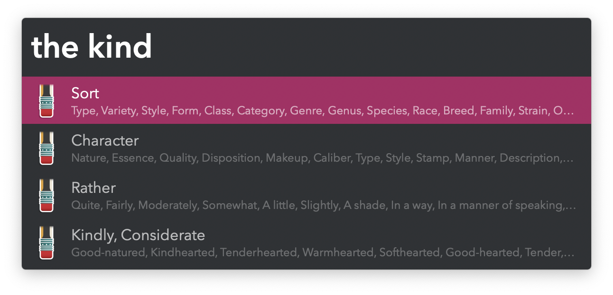
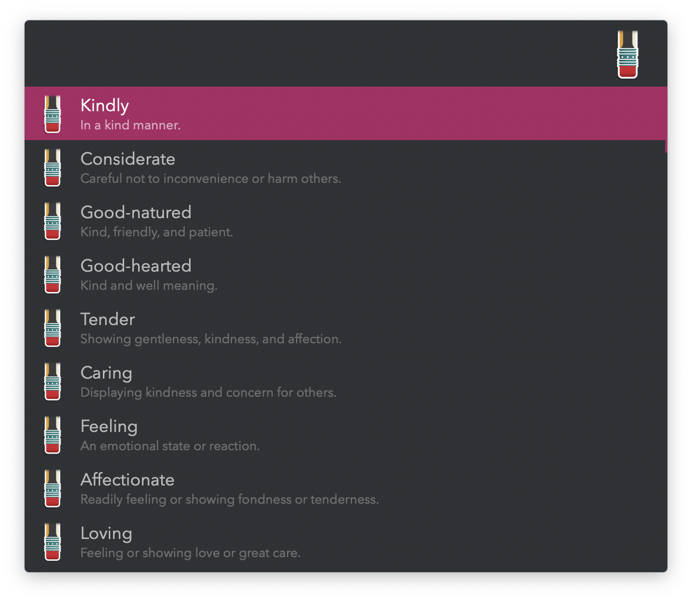
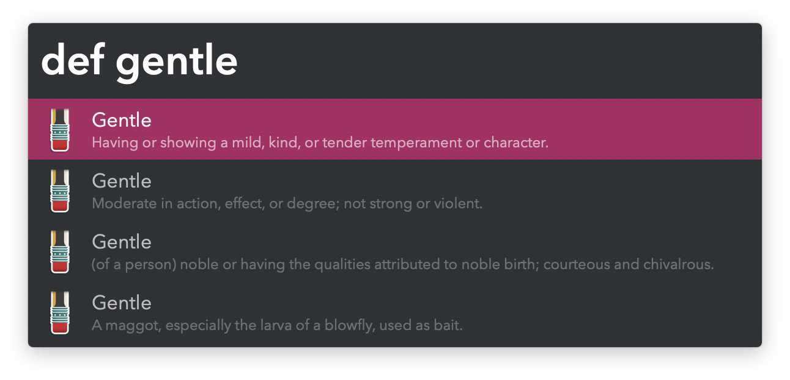
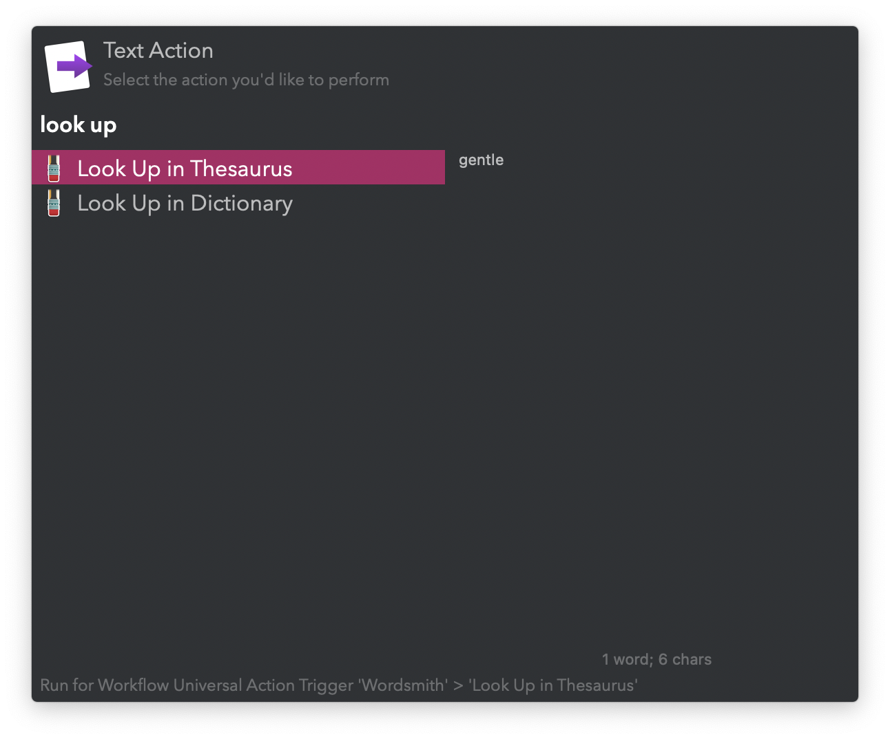

## Setup

Open Dictionary.app. In the menubar: `Dictionary` → `Settings…`. Install the Oxford Dictionary of English and the Oxford American Writer’s Thesaurus.

Build their databases with the `:wordsmithbuild` keyword.

## Usage

### Thesaurus

Search for synonyms via the `the` keyword.

* <kbd>↩</kbd> Show all synonyms in the current entry, with definitions.
* <kbd>⌘</kbd> Show example phrase with the original word.
* <kbd>⌥</kbd> Show antonyms. <kbd>↩</kbd> to show all in the current entry, with definitions.
* <kbd>⇧</kbd><kbd>↩</kbd> Open original word in Dictionary.

When listing all entries from the thesaurus, each word shows a single definition.

* <kbd>↩</kbd> Copy word to clipboard. Pastes to frontmost app if activated via the Universal Action.
* <kbd>⌘</kbd><kbd>↩</kbd> Lookup in thesaurus.
* <kbd>⌥</kbd><kbd>↩</kbd> Lookup more definitions.
* <kbd>⇧</kbd><kbd>↩</kbd> Open in Dictionary.

### Dictionary

Search for word definitions with the `def` keyword.

* <kbd>↩</kbd> Copy word to clipboard. Pastes to frontmost app if activated via the Universal Action.
* <kbd>⌥</kbd><kbd>↩</kbd> Lookup in thesaurus.
* <kbd>⇧</kbd><kbd>↩</kbd> Open in Dictionary.

### Universal Actions

Both the thesaurus and dictionary can be accessed via Universal Actions. With this method, a word selected with <kbd>↩</kbd> pastes to the frontmost app.

Configure the Hotkeys for faster triggering.
