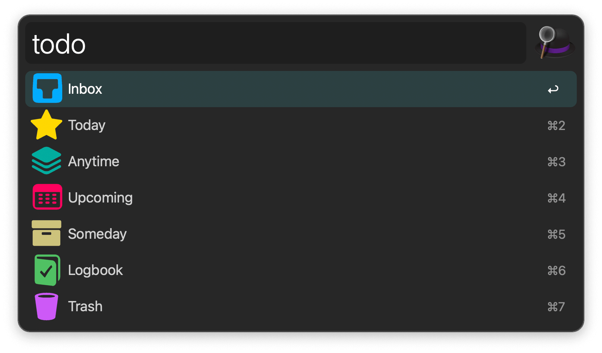
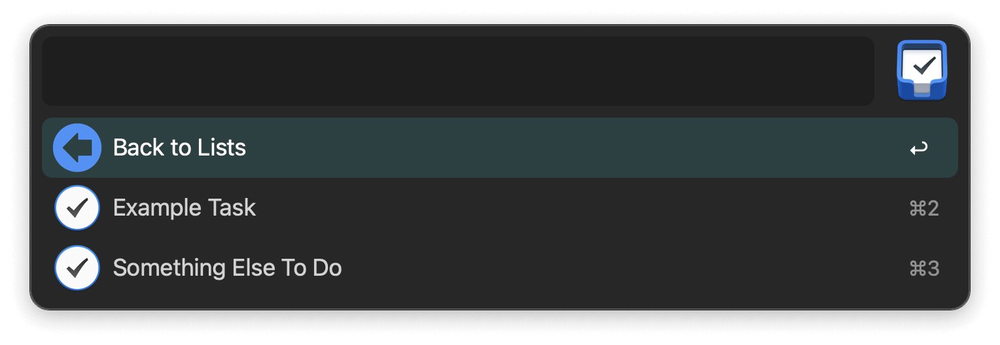

## Usage

Show your Things lists via the `todo` keyword.

* <kbd>↩</kbd> Show list items.
* <kbd>⌘</kbd><kbd>↩</kbd> Open in Things.
* <kbd>⌥</kbd><kbd>↩</kbd> Open Quick Entry window.
* <kbd>⌃</kbd><kbd>↩</kbd> Show tags in list.
* <kbd>fn</kbd><kbd>↩</kbd> Empty Trash.

When displaying a list’s contents, new actions are available.

* <kbd>↩</kbd> Open in Things.
* <kbd>⌘</kbd><kbd>↩</kbd> Mark completed.
* <kbd>⌥</kbd><kbd>↩</kbd> Mark canceled.
* <kbd>⌃</kbd><kbd>↩</kbd> Delete.
* <kbd>fn</kbd><kbd>↩</kbd> Empty Trash.
* <kbd>⇧</kbd><kbd>↩</kbd> Show to-dos in project.
