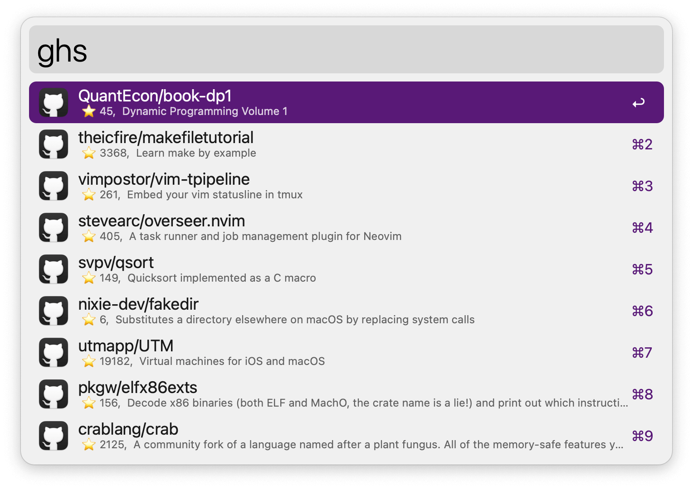

## Usage

Search your starred GitHub repositories via the `ghs` keyword.

* <kbd>↩</kbd> Open repository in web browser.
* <kbd>⌘</kbd><kbd>↩</kbd> Copy URL to clipboard.
* <kbd>⌃</kbd><kbd>↩</kbd> Copy clone command.
