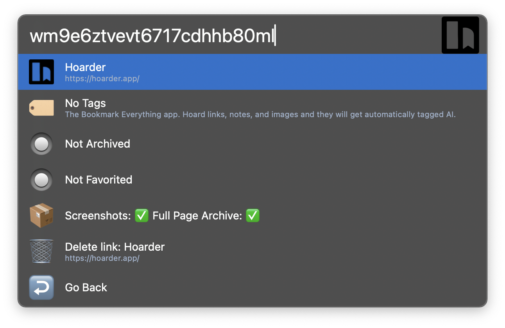

## Setup

This workflow requires Hoarder/Karakeep URL and its API key.

[Self-host](https://docs.karakeep.app/Installation/docker) your own instance or use [official instance](https://cloud.karakeep.app/signin).

Setup an API key on `{hoarder_url}/settings/api-keys`.

## Usage

List and search your bookmarks and notes in your Hoarder (now: Karakeep) server via `hoarder` + keyword, add new links and bookmarks via the `hoard` keyword.

 - <kbd>↩</kbd> : Open link directly
 - <kbd>⌘</kbd><kbd>↩</kbd>: Copy link to clipboard
 - <kbd>⌥</kbd><kbd>↩</kbd>: Open in your Hoarder server
 - <kbd>⌃</kbd><kbd>↩</kbd>: View and control (View tags/Favorite/Archive/Delete)
 - <kbd>⇧</kbd><kbd>↩</kbd>: Copy link in markdown format

