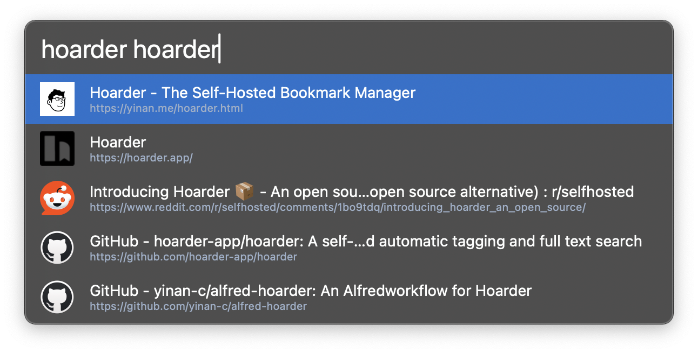

## Setup

Set the URL and API Key of your [Karakeep](https://karakeep.app) installation in the Workflow’s Configuration. You can find the API Token from your Karakeep URL under `/settings/api-keys`.

## Usage

List and search your bookmarks and notes from your Karakeep (previosuly Hoarder) server via the `hoarder` keyword.

 * <kbd>↩</kbd> Open link.
 * <kbd>⌘</kbd><kbd>↩</kbd> Copy link to clipboard.
 * <kbd>⌥</kbd><kbd>↩</kbd> Open in your Karakeep server.
 * <kbd>⌃</kbd><kbd>↩</kbd> View actions such as favorite, archive, and delete.
 * <kbd>⇧</kbd><kbd>↩</kbd> Copy link in markdown format.

Add new bookmarks with the `hoard` keyword.

