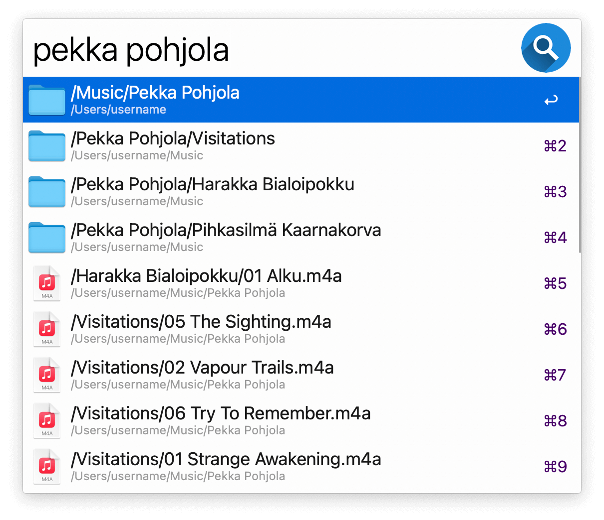
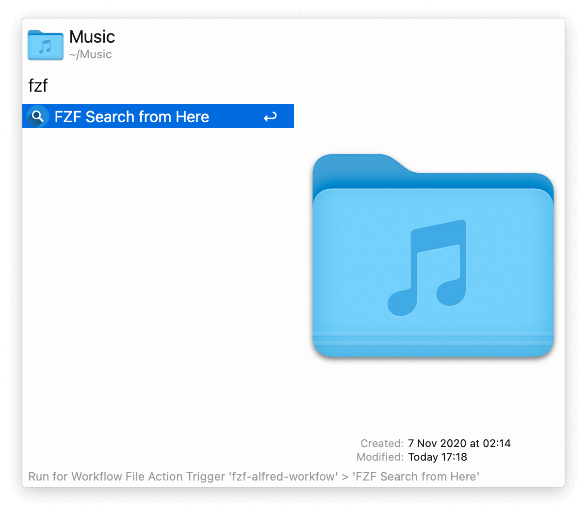
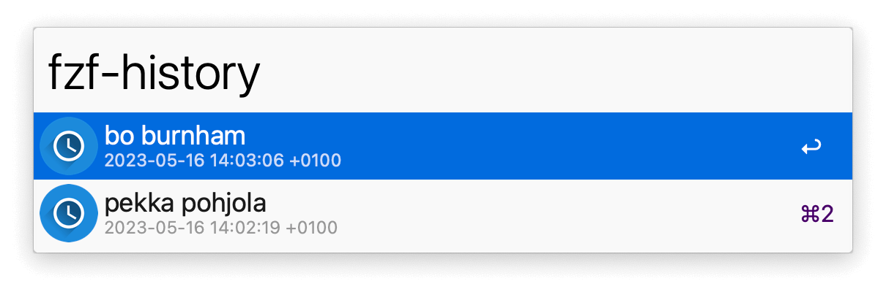
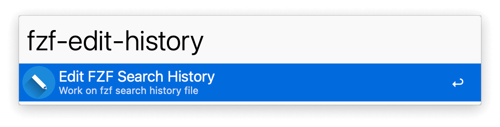

## Usage

Fuzzy search for files and folders via the `fzf` keyword.

Your home folder is searched by default. You can change it in the Workflow’s Configuration. Use the Universal Action to initiate the search from a specific folder.

Configure the Hotkeys or Fallback Search for alternative triggering methods.

See your search history with `fzf-history` or act on its file with `fzf-edit-history`.

