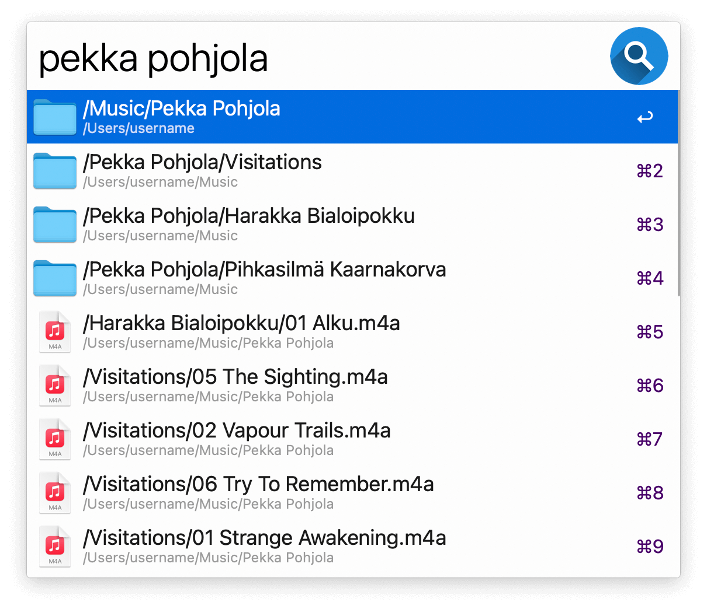
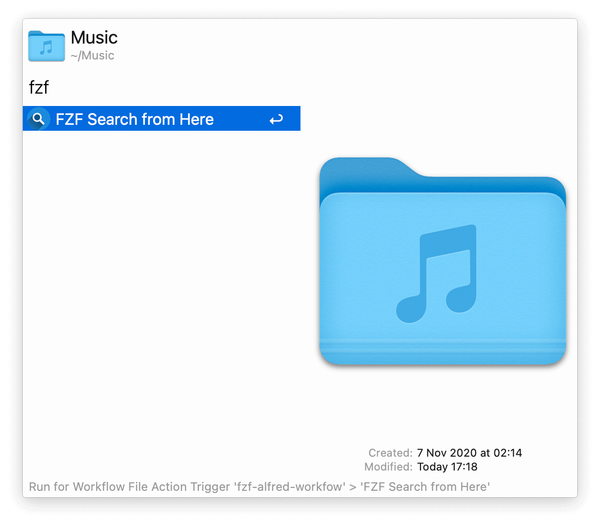
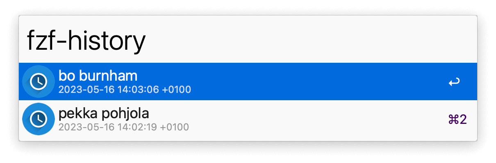
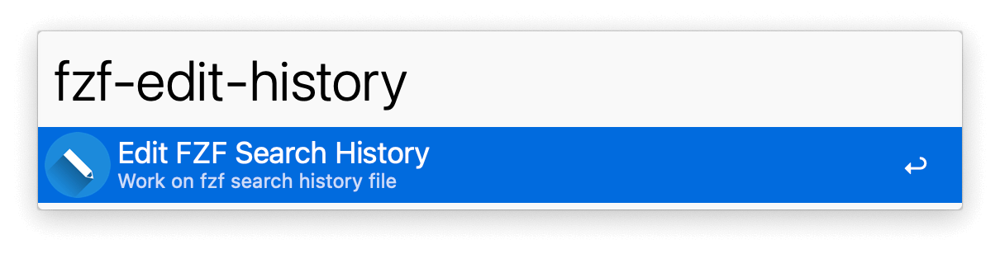

## Usage

Fuzzy search for files and folders via the `fzf` keyword.

* <kbd>↩</kbd> Open the file or folder.
* <kbd>⌘</kbd><kbd>↩</kbd> Reveal the file or folder in the Finder.
* <kbd>⌃</kbd><kbd>↩</kbd> or <kbd>⌥</kbd><kbd>↩</kbd> Copy the path to the clipboard.
* <kbd>⇧</kbd><kbd>↩</kbd> Open the enclosing folder.
* <kbd>⌘</kbd><kbd>Y</kbd> Quick Look the file or folder.

Your home folder is searched by default. You can change it in the Workflow’s Configuration. Use the Universal Action to initiate the search from a specific folder.

Configure the Hotkeys or Fallback Search for alternative triggering methods.

See your search history with `fzf-history` or act on its file with `fzf-edit-history`.

