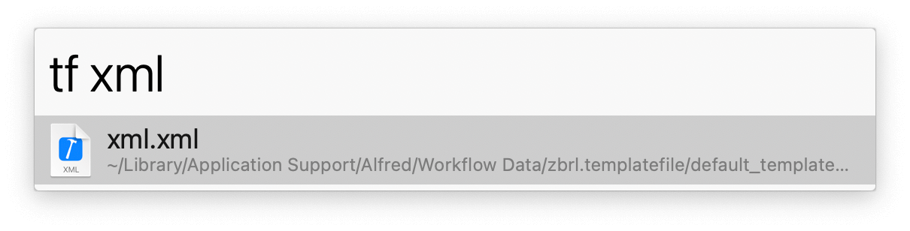

## Usage

Create new files in the frontmost Finder folder via the `new` keyword. Add an extension to create a file of the correct type or leave it empty to create a folder.

Search available file types with the `tf` keyword. This works *after `new` or `opentf` has been run at least once.*

Add your own custom file types by copying an empty file of that type to the templates directory, which you can open with the `opentf` keyword.

