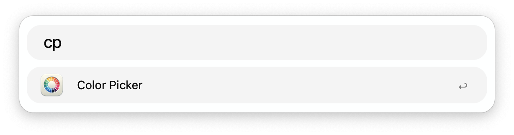
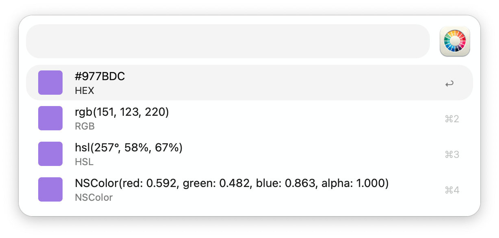
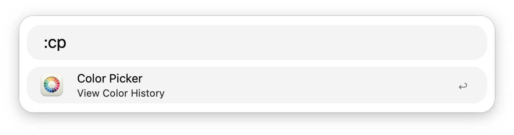
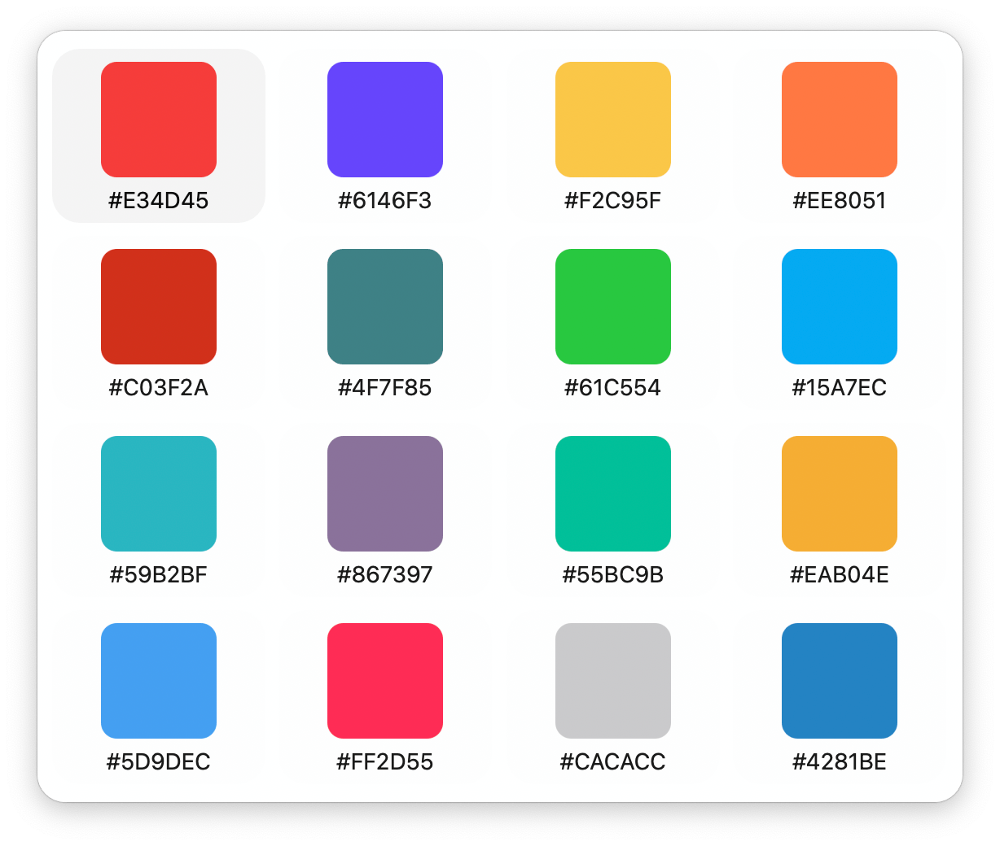

## Usage

Activate the Color Sampler via the `cp` keyword and click the desired color on your screen. Different representations will show in Alfred, press <kbd>↩</kbd> to copy any.

View colour history with the `:cp` keyword.

