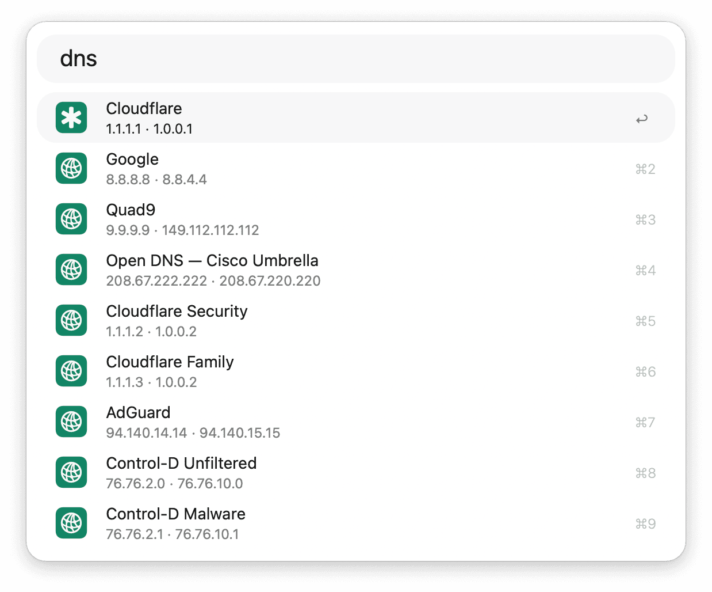
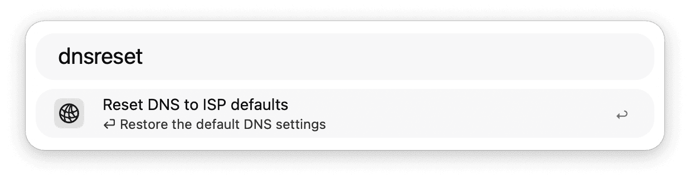
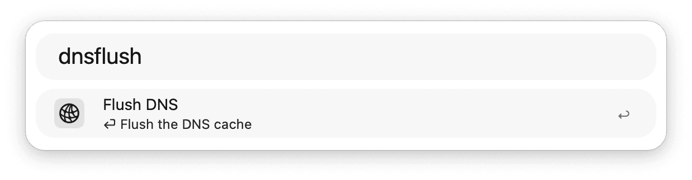
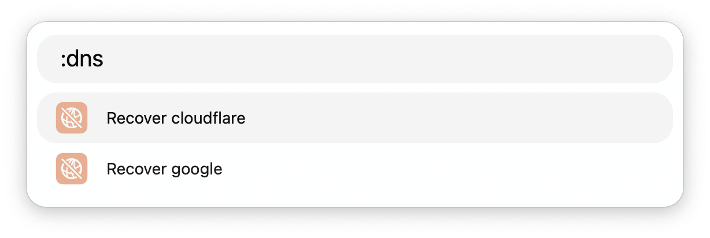

## Usage

Change your preferred DNS resolver via the `dns` keyword.

* <kbd>↩</kbd> Change DNS servers.
* <kbd>⌘</kbd><kbd>↩</kbd> Test DNS resolver responsiveness.
* <kbd>⌥</kbd><kbd>↩</kbd> Open the correlating website.
* <kbd>⌘</kbd><kbd>⇧</kbd><kbd>↩</kbd> Ignore DNS resolver.
* <kbd>⌥</kbd><kbd>⇧</kbd><kbd>↩</kbd> Open [DNSPerf](https://www.dnsperf.com) website if available.
* <kbd>⌘</kbd><kbd>Y</kbd> Quick Look correlating website.
* <kbd>⌘</kbd><kbd>L</kbd> View DNS resolver info as Large Type.
* <kbd>⌃</kbd> Show description.

Restore DNS settings to your ISP's defaults with the `dnsreset` keyword, or clear your local DNS cache with the `dnsflush` keyword.

Previously ignored services can be recovered via the `:dns` keyword.

* <kbd>↩</kbd> Recover DNS option.
* <kbd>⌘</kbd><kbd>↩</kbd> Go to the DNS resolver list.
