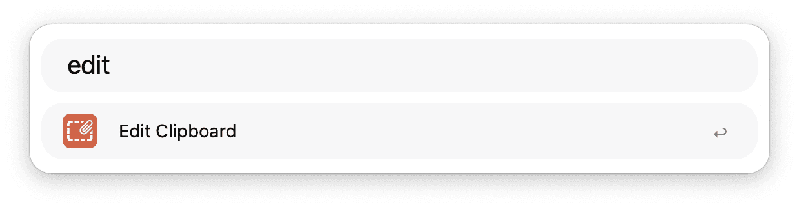
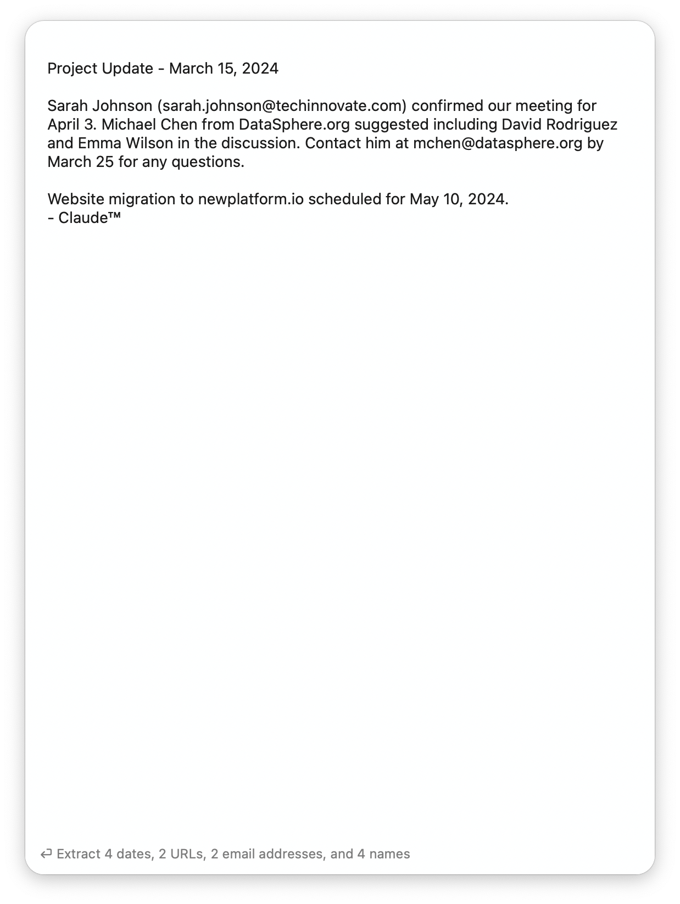
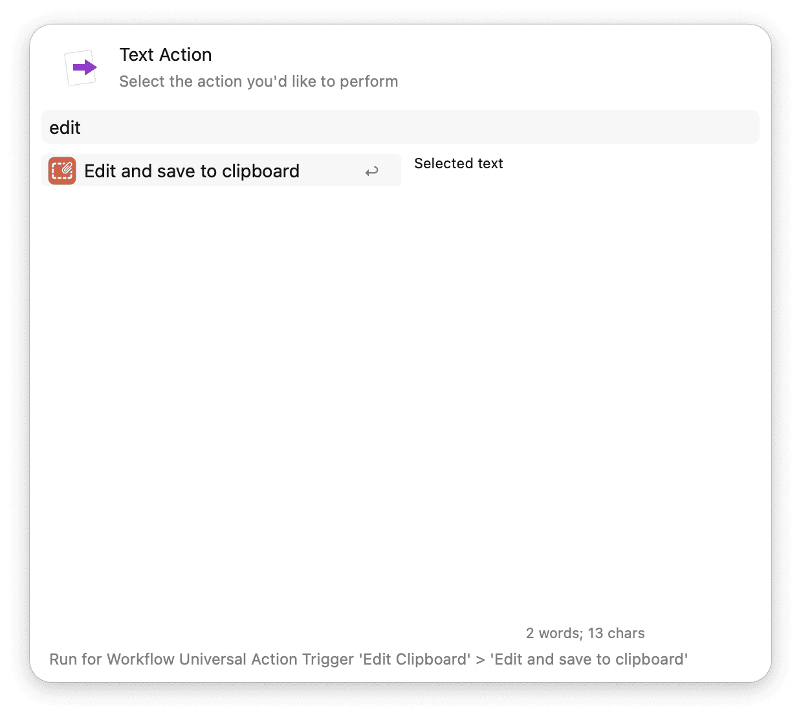
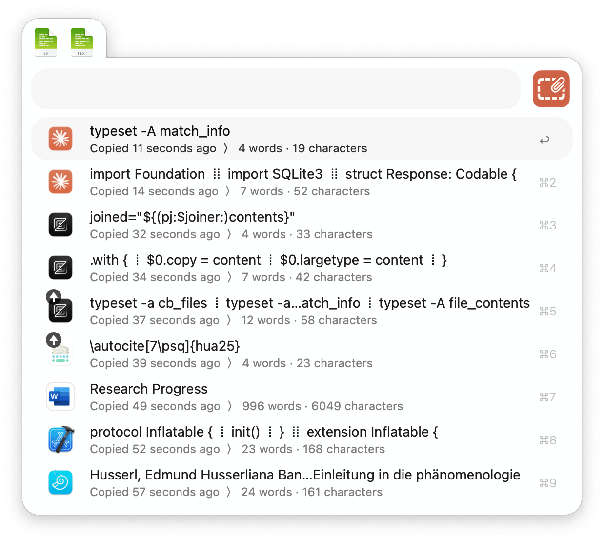
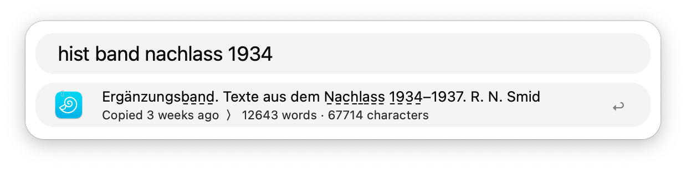

## Usage

Access and edit your clipboard contents via the `edit` keyword. 

* <kbd>↩</kbd> Edit the clipboard.
* <kbd>⌘</kbd><kbd>↩</kbd> Proceed retaining metadata.
* <kbd>⌥</kbd><kbd>↩</kbd> Proceed ignoring metadata.

* <kbd>⌘</kbd><kbd>↩</kbd> Save clipboard.
* <kbd>⌥</kbd><kbd>↩</kbd> Extract data (if available).
* <kbd>⌃</kbd><kbd>↩</kbd> Action clipboard text in Alfred.
* <kbd>⌘</kbd><kbd>⌥</kbd><kbd>↩</kbd> Save clipboard and continue.
* <kbd>⌘</kbd><kbd>⇧</kbd><kbd>↩</kbd> Add items from the **integrated clipboard history**.

Alternatively, use the Universal Action to edit and copy text to the clipboard.

### Integrated Clipboard History

* <kbd>⌘</kbd><kbd>↩</kbd> (or <kbd>↩</kbd>) Append to clipboard.
* <kbd>⌘</kbd><kbd>⇧</kbd><kbd>↩</kbd> Prepend to clipboard.
* <kbd>⌥</kbd><kbd>↩</kbd> Append all buffered clipboard items.
* <kbd>⌥</kbd><kbd>⇧</kbd><kbd>↩</kbd> Prepend all buffered clipboard items.
* <kbd>⇧</kbd><kbd>↩</kbd> Skip and return to editing.
* <kbd>⇥</kbd> Limit query to selected application applying **clipboard filter**.
* <kbd>⌃</kbd> View information if subtext is disabled.
* <kbd>⌘</kbd><kbd>Y</kbd> Quick Look the clipboard contents.
* <kbd>⌘</kbd><kbd>L</kbd> Preview the clipboard contents as Large Type.

### Standalone Clipboard History

Use the *standalone* variant as Alfred clipboard history replacement via the `hist` keyword, or by defining the dedicated Hotkey Trigger. 

* <kbd>↩</kbd> Paste to frontmost application.
* <kbd>⌘</kbd><kbd>↩</kbd> Inspect and edit clipboard item.
* <kbd>⌥</kbd><kbd>↩</kbd> Action clipboard text in Alfred.
* <kbd>⌘</kbd><kbd>C</kbd> Copy to clipboard.
* <kbd>⇥</kbd> Limit query to selected application applying **clipboard filter**.
* <kbd>⌃</kbd> View information if subtext is disabled.
* <kbd>⌘</kbd><kbd>Y</kbd> Quick Look the clipboard contents.
* <kbd>⌘</kbd><kbd>L</kbd> Preview the clipboard contents as Large Type.

### Clipboard Filters

Type the prefix `:::` to filter clipboard items copied from specific applications. Tip: Tap <kbd>⇥</kbd> twice to reach the app selector.

* <kbd>↩</kbd> (or tap <kbd>⇥</kbd>) Limit to clipboard items that originate from the selected application..

