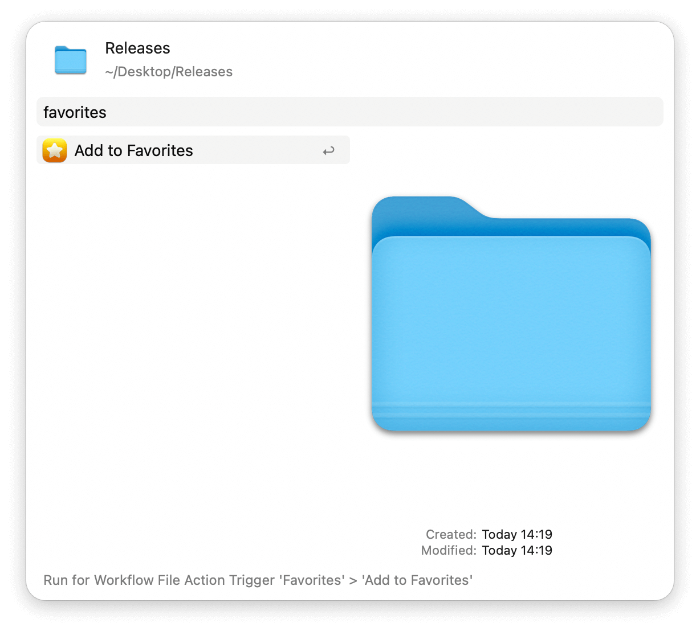
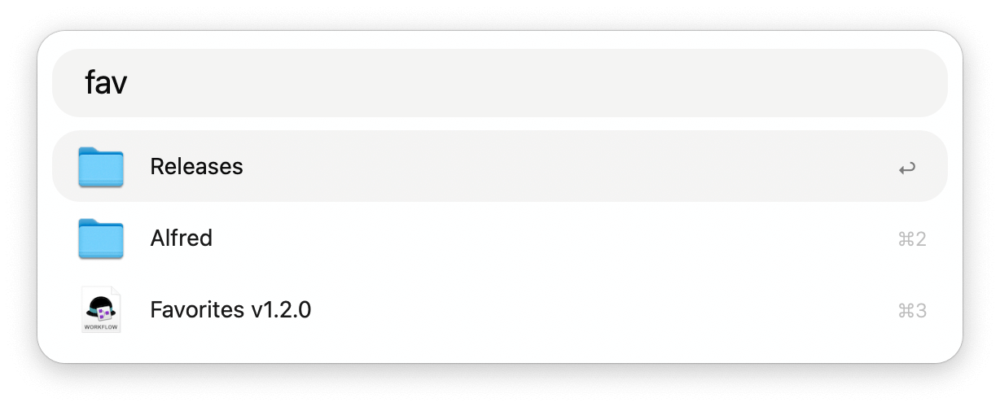

## Usage

Add items to your favorites via the Universal Action. Find them later via the `fav` keyword or configure the Hotkey for quicker access.

* <kbd>↩</kbd> Open file or folder.
* <kbd>⌘</kbd><kbd>↩</kbd> Reveal in Finder.
* <kbd>⌥</kbd><kbd>↩</kbd> Browse in Alfred.
* <kbd>fn</kbd><kbd>↩</kbd> Remove from favorites.
* <kbd>⌘</kbd><kbd>Y</kbd> Quick Look.
* <kbd>⌘</kbd><kbd>⇧</kbd><kbd>↩</kbd> Move item up in the list.
* <kbd>⌥</kbd><kbd>⇧</kbd><kbd>↩</kbd> Move item down in the list.
