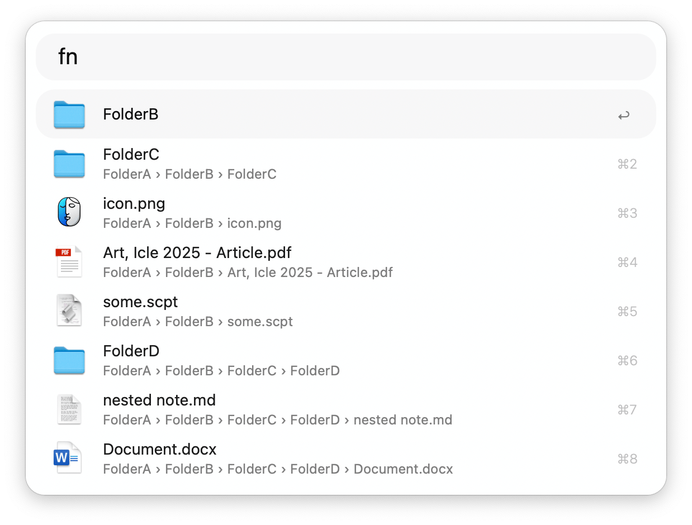
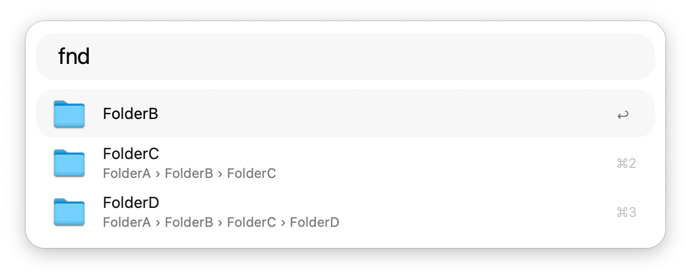

## Usage

Find files and folders nested within folders of the active Finder window via the `fn` keyword. Alternatively, use the `fnd` keyword to only search for folders.

* <kbd>↩</kbd> Open file or folder.
* <kbd>⌘</kbd><kbd>↩</kbd> Reveal file or folder.
* <kbd>⌥</kbd><kbd>↩</kbd> Browse in Alfred.
* <kbd>⌘</kbd><kbd>L</kbd> View the unabridged file path as Large Type.
* <kbd>⌃</kbd> View file path.
