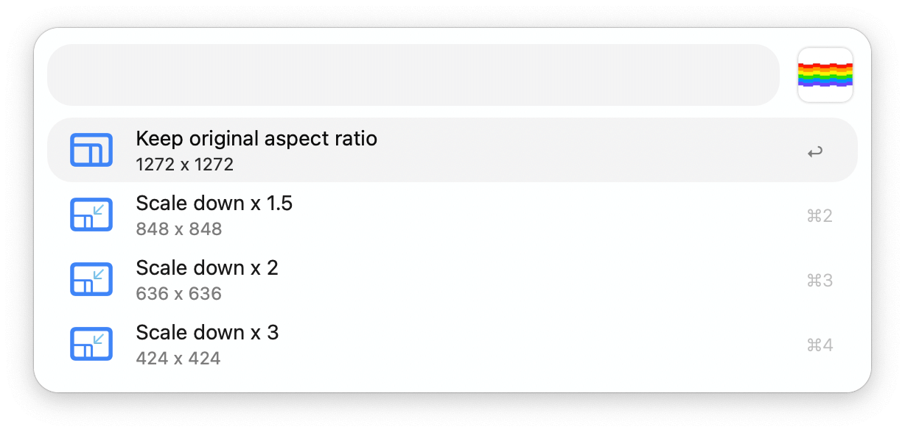

## Usage 

Convert video files to animated GIFs via the Universal Action.

Alternatively, find videos to convert with the `gifify` keyword. 

Select the size of the resulting GIF from the list and press <kbd>↩</kbd>.

