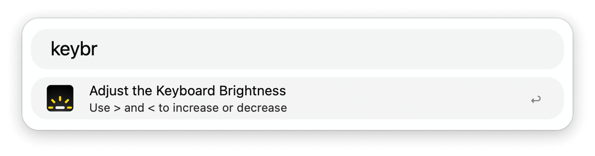

## Usage 

Change the brightness of the keyboard backlight via the `keybr` keyword.

* <kbd>></kbd> (or <kbd>+</kbd>) Increase keyboard brightness.
* <kbd><</kbd> (or <kbd>-</kbd>) Decrease keyboard brightness.

Alternatively, configure the Hotkeys to adjust the brightness with keyboard shortcuts.
