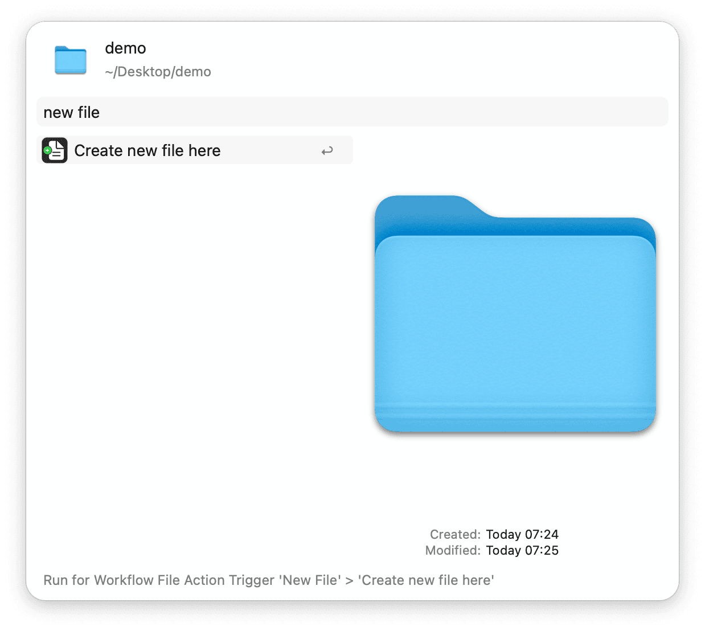

## Usage

Create a new file at your latest Finder location via the `new` keyword.

* <kbd>↩</kbd> Begin creating a new file.
* <kbd>⌘</kbd><kbd>↩</kbd> Search and select the location of the new file.

Alternatively, create a new file at the specified location via the Universal Action.

Configure the Hotkey to initiate creating a new file or to create it immediately if the `posthaste` behaviour is enabled in the Workflow’s Configuration.

### Creating a New File

* <kbd>↩</kbd> Create the file with the given parameters.
* <kbd>⌘</kbd> Hold to view the full path of the target folder.
* <kbd>⌘</kbd><kbd>⇧</kbd><kbd>↩</kbd> Create the file *with clipboard* contents.
* <kbd>⌥</kbd><kbd>⇧</kbd><kbd>↩</kbd> Create the file *without clipboard* contents.
* <kbd>⇥</kbd> Accept and expand the auto-suggested file extension.

In addition to all plain-text type files, the workflow can also quickly create `docx`, `doc`, `odt`, `rtf`, `rtfd`, and Xcode `playground` files.

To create dotfiles without extension, use the double-dot prefix. For example, `..gitignore` creates `.gitignore`.

