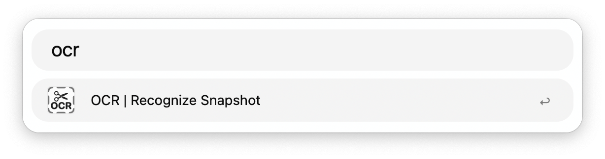
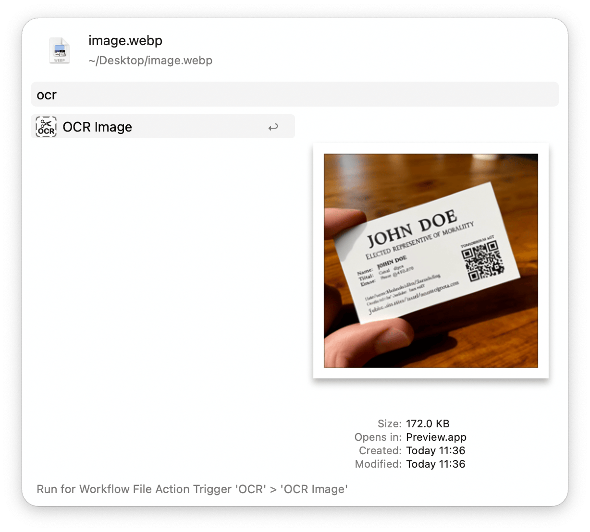

## Setup

Specify the languages you want to recognise in the Workflow’s Configuration.

## Usage

Initiate a screenshot via the `ocr` keyword or triggering the configured Hotkey. It will undergo [optical character recognition](https://en.wikipedia.org/wiki/Optical_character_recognition) to extract the text and copy it to the clipboard.

Alternatively, OCR an image via the Universal Action.

**Note:** URLs detected in QR codes will also be copied to the clipboard.
