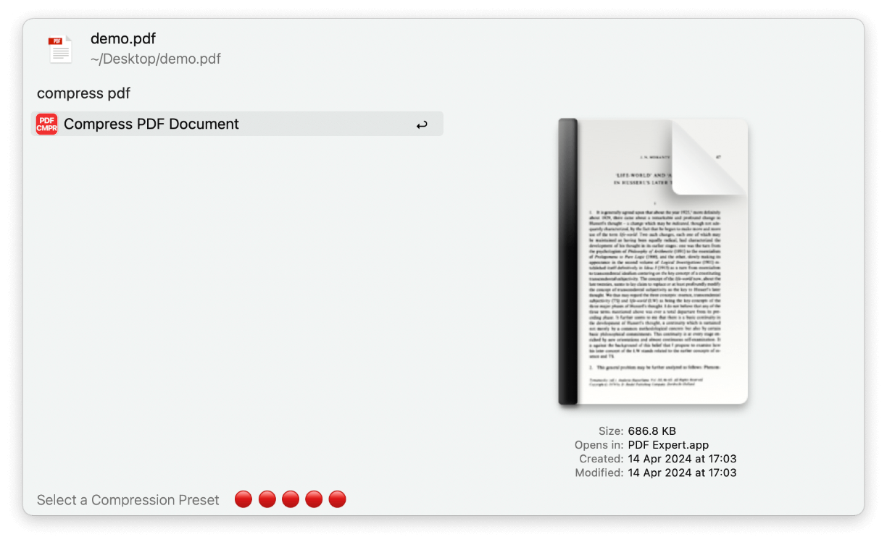
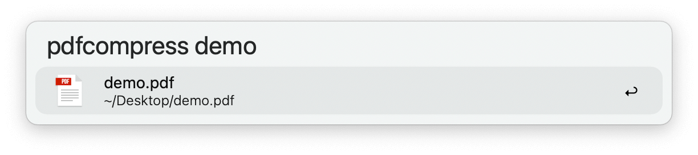
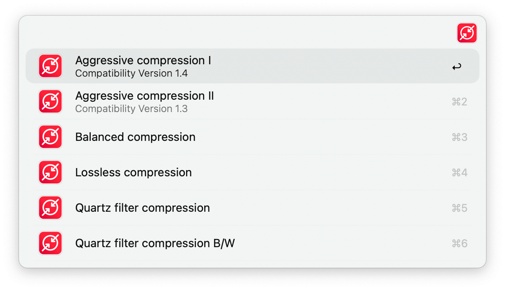

## Usage

Compress PDF documents via the Universal Action.

Alternatively, find PDFs via the `pdfcompress` keyword.

* <kbd>↩</kbd> Proceed to compress the PDF using the default strategy.
* <kbd>⌥</kbd><kbd>↩</kbd> Select a compression preset.

---

### Compression Presets

* <kbd>↩</kbd> Proceed to compress the PDF using the selected strategy.

The result will be a compressed document exported to the same location as the source PDF file.
