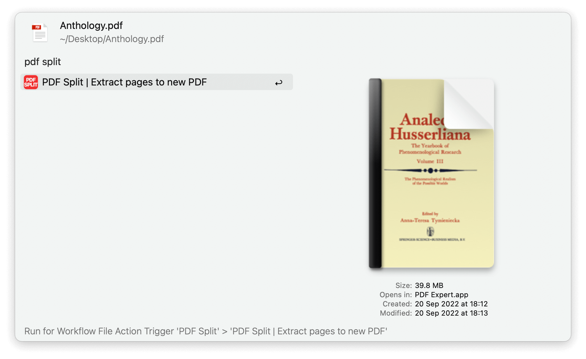
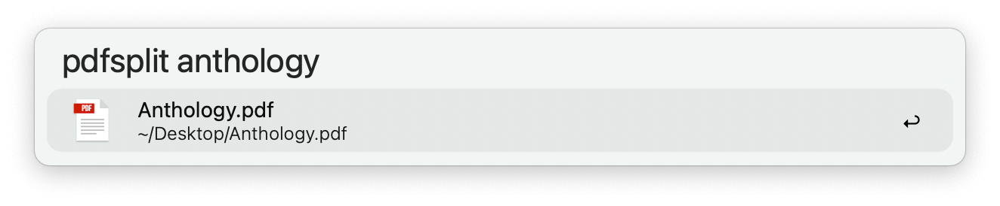
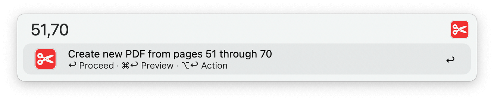
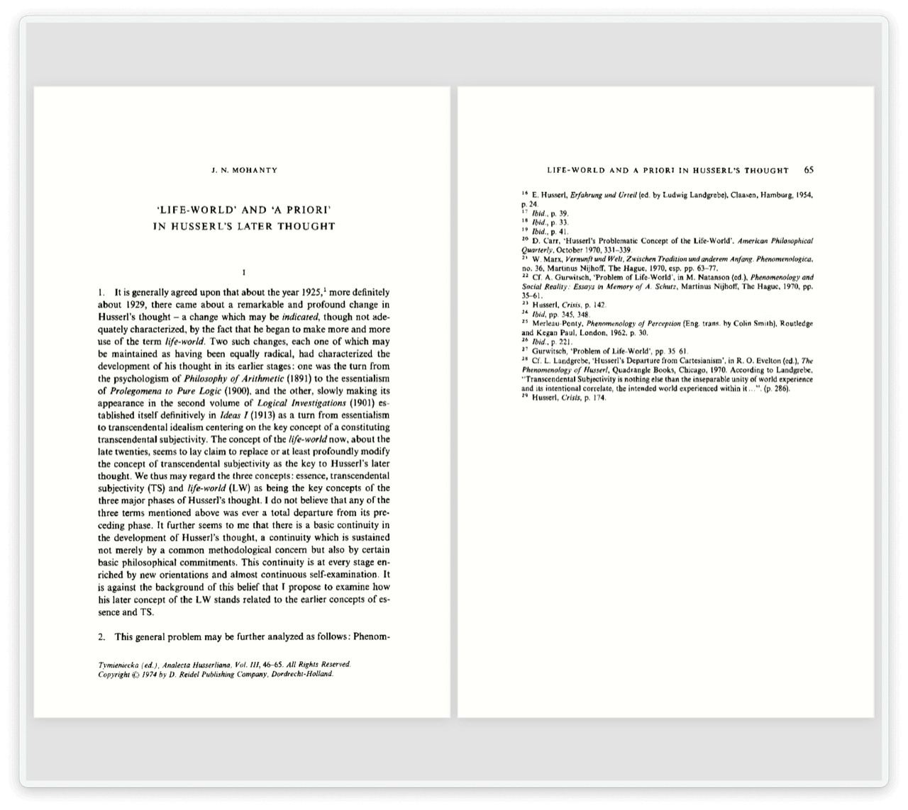

## Usage

Extract a range of pages from a PDF via the Universal Action.

Alternatively, find PDFs via the `pdfsplit` keyword.

---

### Specifying the Pages

* <kbd>↩</kbd> Proceed to create a new PDF from the specified pages.
* <kbd>⌘</kbd><kbd>↩</kbd> Preview the first and last PDF pages with Alfred’s PDF View.
* <kbd>⌥</kbd><kbd>↩</kbd> Proceed, push the result to the File Buffer and open the Universal Actions panel.

* <kbd>↩</kbd> Return to the view where you can set the start and end pages.
