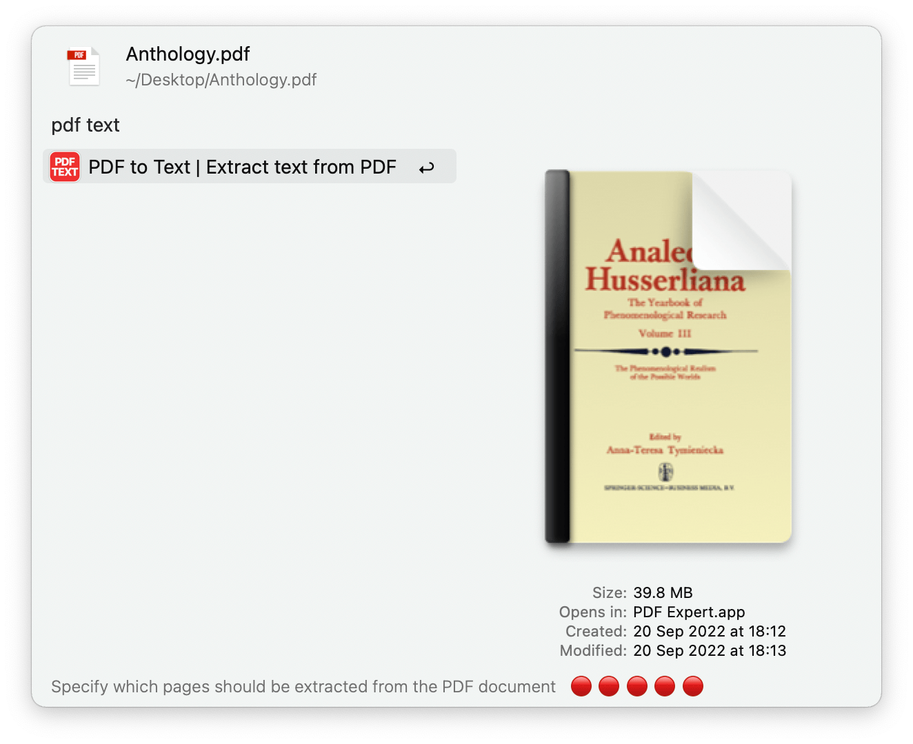
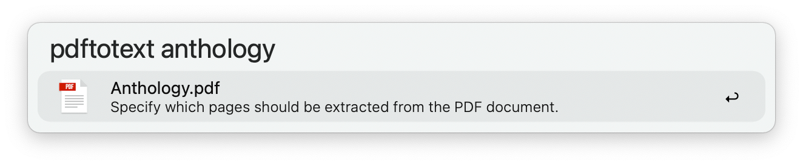
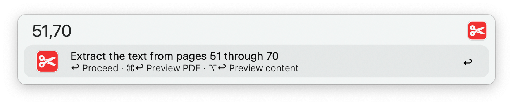
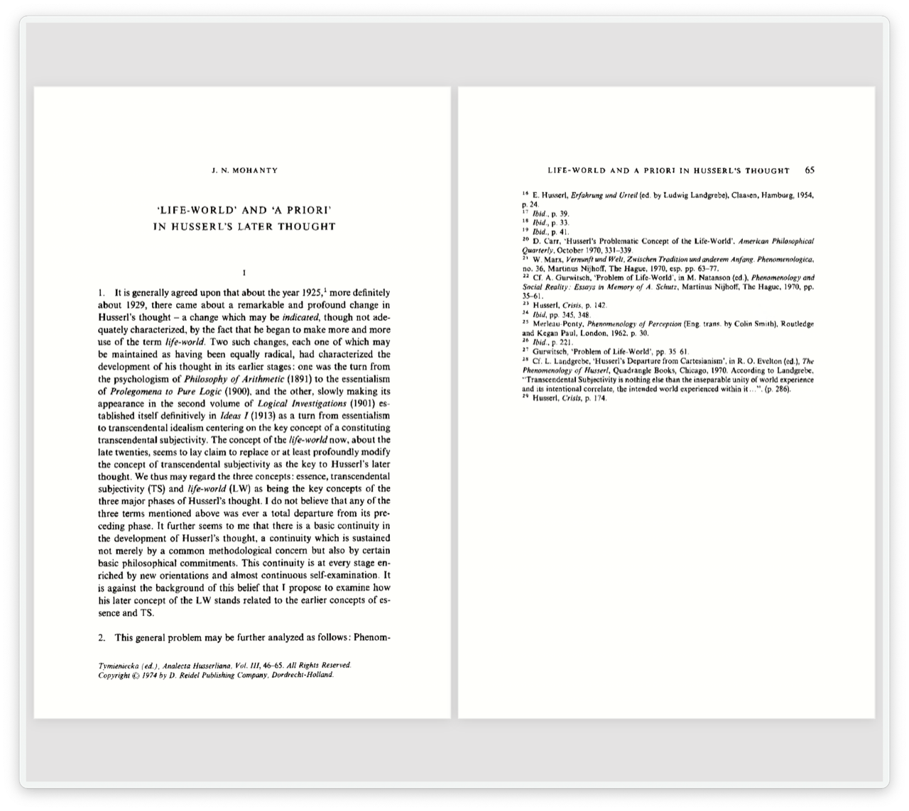
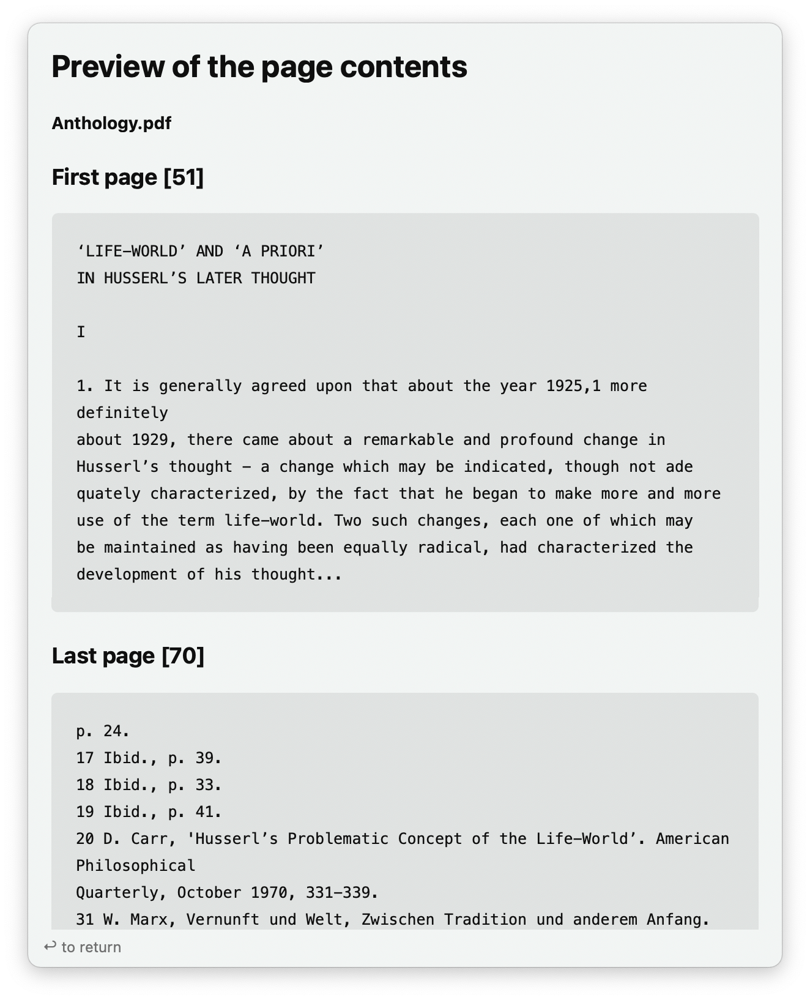

## Usage

Extract the entire text from one or more PDFs via the Universal Action.

Alternatively, find PDFs via the `pdftotext` keyword.

* <kbd>↩</kbd> Proceed to extract the entire text.
* <kbd>⌘</kbd><kbd>↩</kbd> Proceed by specifying the pages to extract (single file only).
* <kbd>⌃</kbd><kbd>↩</kbd> Proceed, push the result to the File Buffer and open the Universal Actions panel.

---

### Specifying the Pages

* <kbd>↩</kbd> Proceed to extract text from the specified pages.
* <kbd>⌘</kbd><kbd>↩</kbd> Preview the first and last PDF pages with Alfred’s PDF View.
* <kbd>⌥</kbd><kbd>↩</kbd> Preview the contents of the first and last page with Alfred’s Text View.
* <kbd>⌃</kbd><kbd>↩</kbd> Proceed, push the result to the File Buffer and open the Universal Actions panel.

* <kbd>↩</kbd> Return to the view where you can set the start and end pages.
