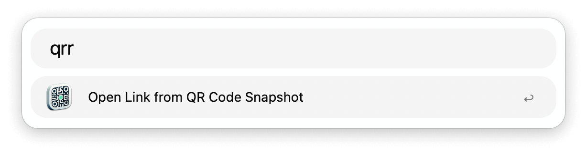
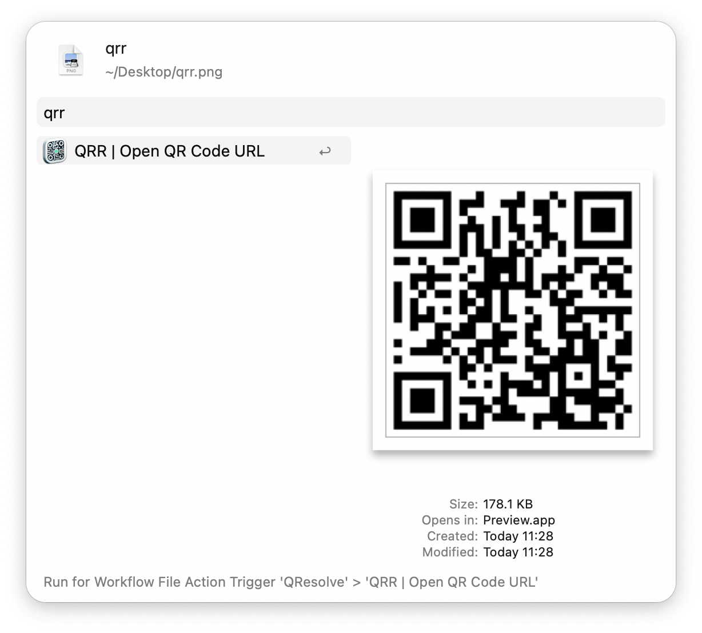

## Usage

Take a screenshot of the QR code from which you want to open the link of via the `qrr` keyword.

Alternatively, parse an image containing the QR code with the Universal Action.

Configure the Hotkey for faster triggering.
