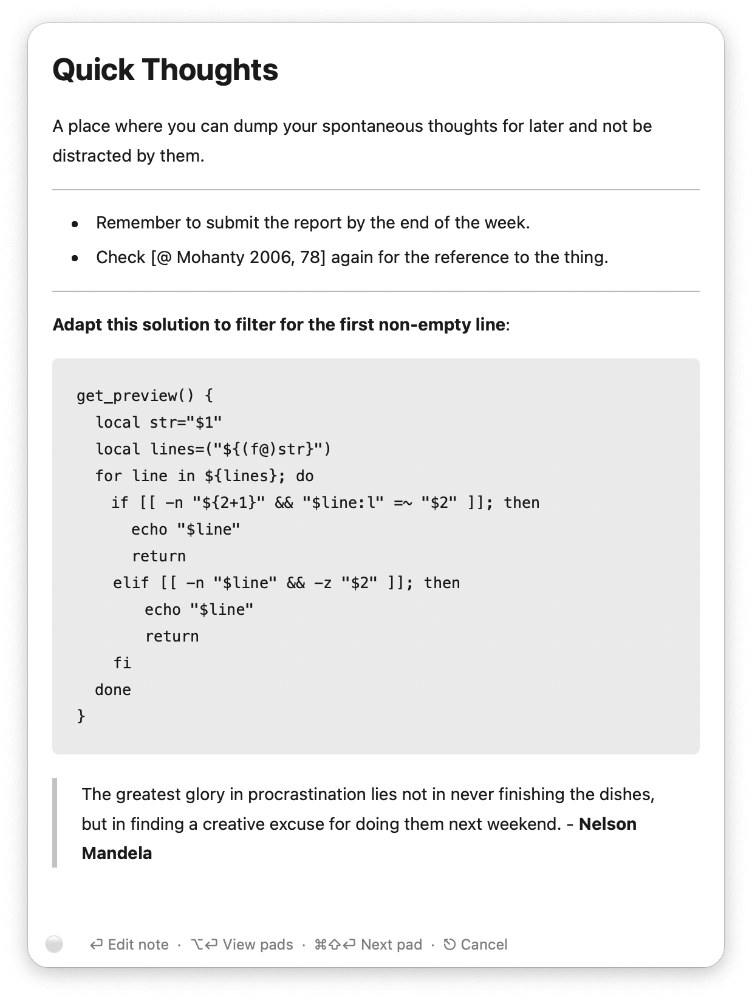
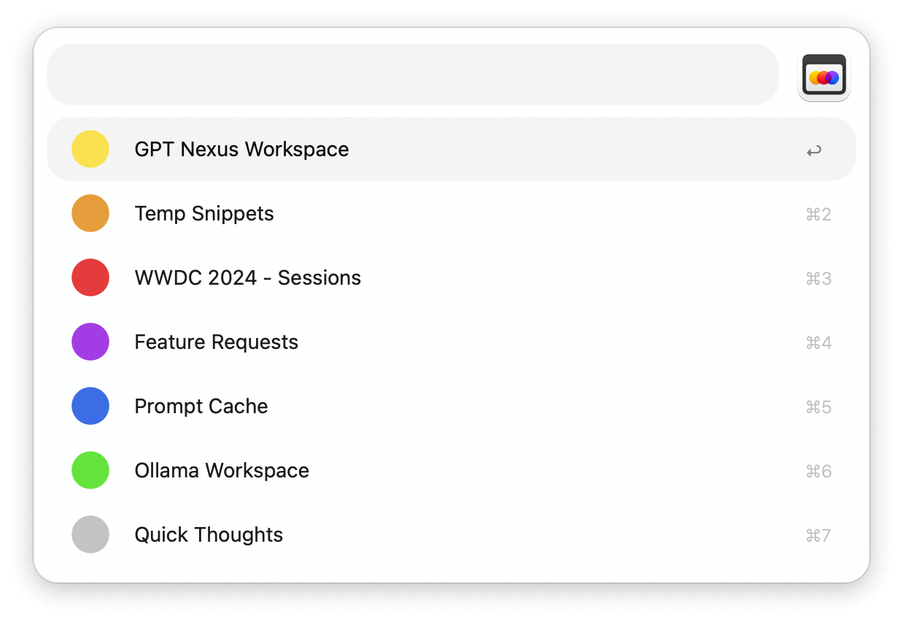
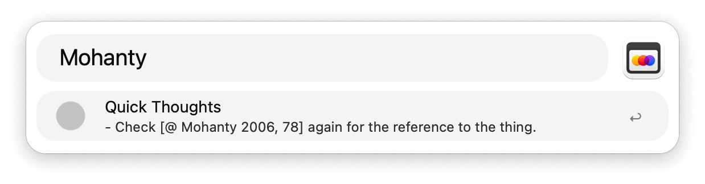

## Setup

Configure the Primary Entry Point and Secondary Entry Point Hotkeys used to invoke the workflow.

In the Workflow’s Configuration, optionally set up how many scratchpads to use, your preferred file extension, and the notes save location.

## Usage 

Press the `Primary` Hotkey to open the last used scratchpad. Press the Hotkey again or <kbd>⎋</kbd> to dismiss it without saving.

In **Editing Mode**

* <kbd>⌘</kbd><kbd>↩</kbd> Save changes. Also happens when previewing or switching the active pad.
* <kbd>⇧</kbd><kbd>↩</kbd> Preview as rendered markdown.
* <kbd>⌥</kbd><kbd>↩</kbd> View all pads and search your notes.
* <kbd>⌘</kbd><kbd>⇧</kbd><kbd>↩</kbd> Cycle through your scratchpads.

In **Markdown Mode**

* <kbd>↩</kbd> (or <kbd>⇧</kbd><kbd>↩</kbd>) Start editing.
* <kbd>⌥</kbd><kbd>↩</kbd> View all pads and search your notes.
* <kbd>⌘</kbd><kbd>⇧</kbd><kbd>↩</kbd> Cycle through your scratchpads.
* <kbd>⎋</kbd> Cancel or go back through previously viewed pads.

---

Press the `Secondary` Hotkey to view all scratchpads and search their contents. Alternatively, open the view with the `pad` keyword.

* <kbd>↩</kbd> to open the pad.
* <kbd>⌘</kbd><kbd>L</kbd> on a filtered pad to view the matched line as Large Type.
* <kbd>⌘</kbd><kbd>Y</kbd> Quick Look the pad.
