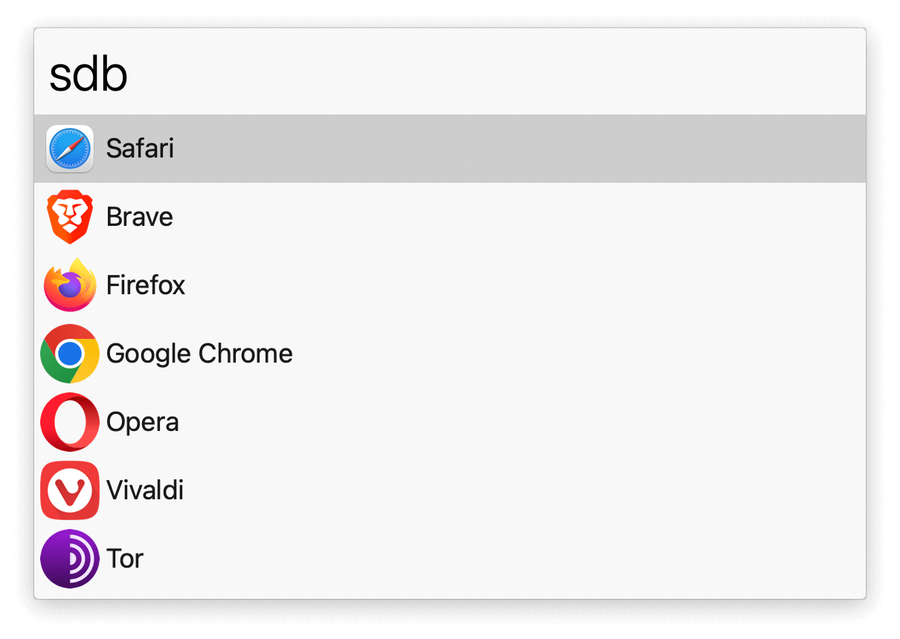
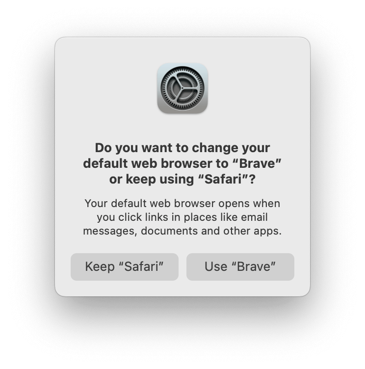
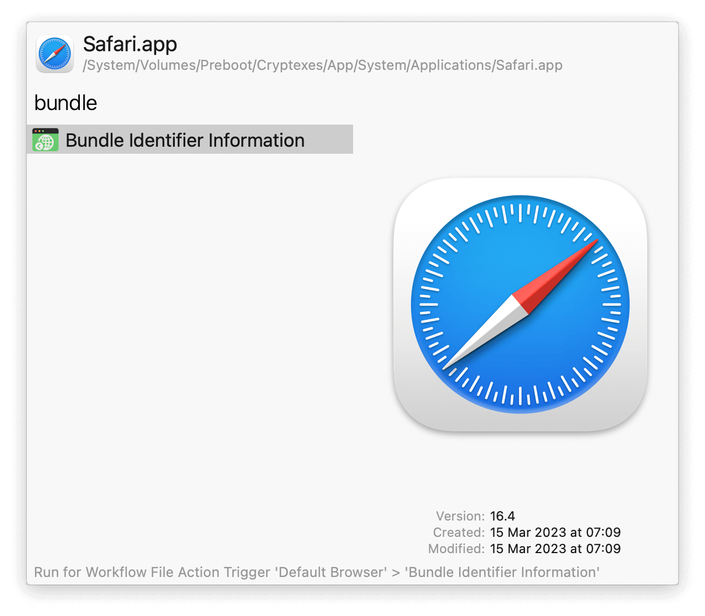
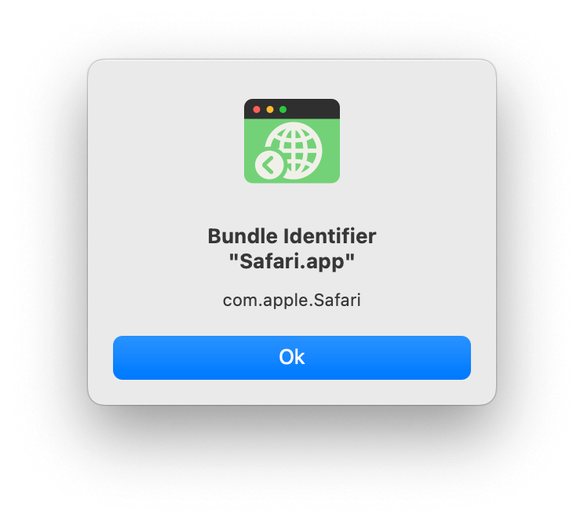

## Usage

Set the default web browser via the `sdb` keyword. The macOS browser change confirmation dialog will be auto-accepted.

* <kbd>⌘</kbd> Set as default browser.
* <kbd>⌘</kbd><kbd>⇧</kbd><kbd>↩</kbd> Blacklist the application.
* <kbd>⌃</kbd> View the file path of the application.

See the bundle identifier of an app via the Universal Action.

