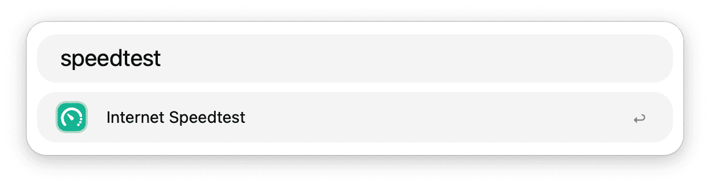
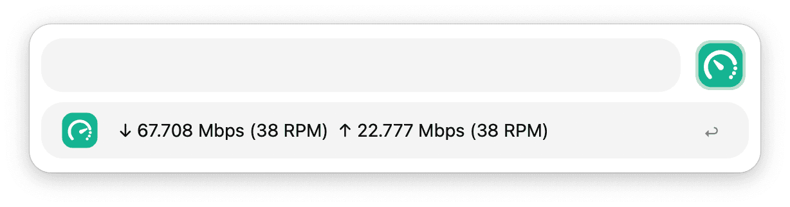
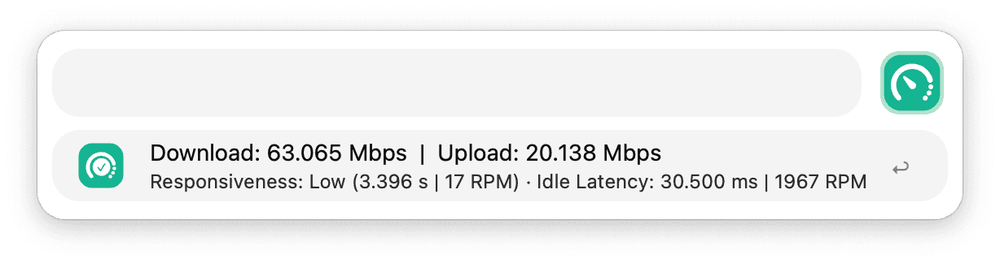

## Usage

Check the speed of your internet connection via the `speedtest` keyword.

* <kbd>↩</kbd> Start the speed test.
* <kbd>⌘</kbd><kbd>↩</kbd> Start the speed test sequentially / in parallel.

* <kbd>⌘</kbd><kbd>↩</kbd> Rerun the speed test
* <kbd>⌘</kbd><kbd>⇧</kbd><kbd>↩</kbd> Rerun the speed test sequentially / in parallel.
