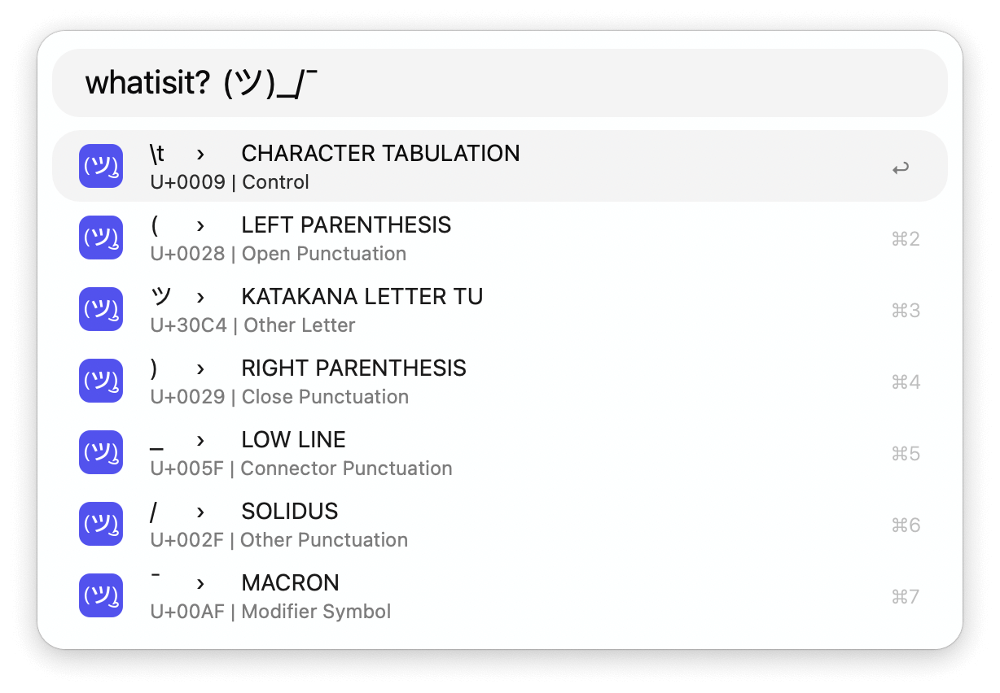

## Usage

Inspect unicode characters via the `whatisit?` keyword.

* <kbd>↩</kbd> Copy the Unicode character..
* <kbd>⌘</kbd><kbd>↩</kbd> Copy the Swift, ES6 formatted code unit (e.g. `\u{30C4}`).
* <kbd>⌥</kbd><kbd>↩</kbd> Copy the Python, Go-lang formatted code unit (e.g. `\u30C4`).
* <kbd>⌃</kbd><kbd>↩</kbd> Copy the HTML entity (e.g. `&#x30C4;`).
* <kbd>⇧</kbd><kbd>↩</kbd> Copy the hex literal (e.g. `0x30C4`).

### Inverse Check

Specifying a hex value, either raw or in one of the above formats, will return its corresponding Unicode character.

