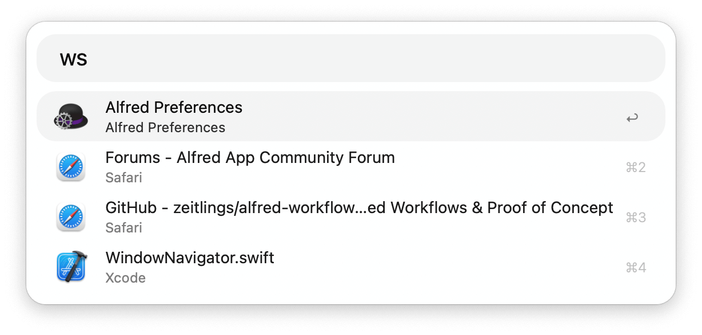
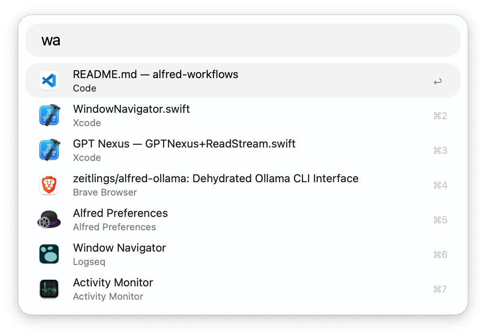

## Usage

### Navigator

Search the windows of the active app globally via the `ww` keyword.

### Switcher

Search app windows in the current desktop space via the `ws` keyword.

### Global

Search all visible windows of all apps globally via the `wa` keyword.

In all cases:

* <kbd>↩</kbd> Navigate to the selected window.
* <kbd>⌘</kbd><kbd>↩</kbd> Close the selected window.
* <kbd>⌥</kbd><kbd>↩</kbd> Quit the owning application.

Configure the Hotkeys for faster triggering.
