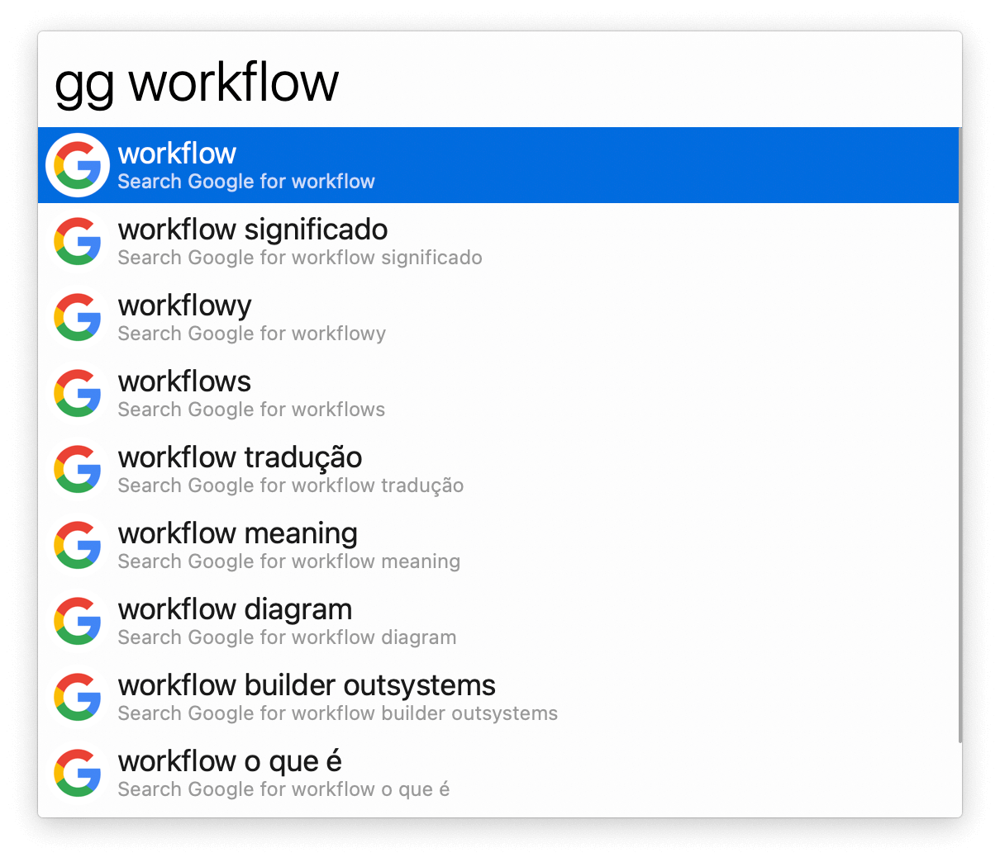
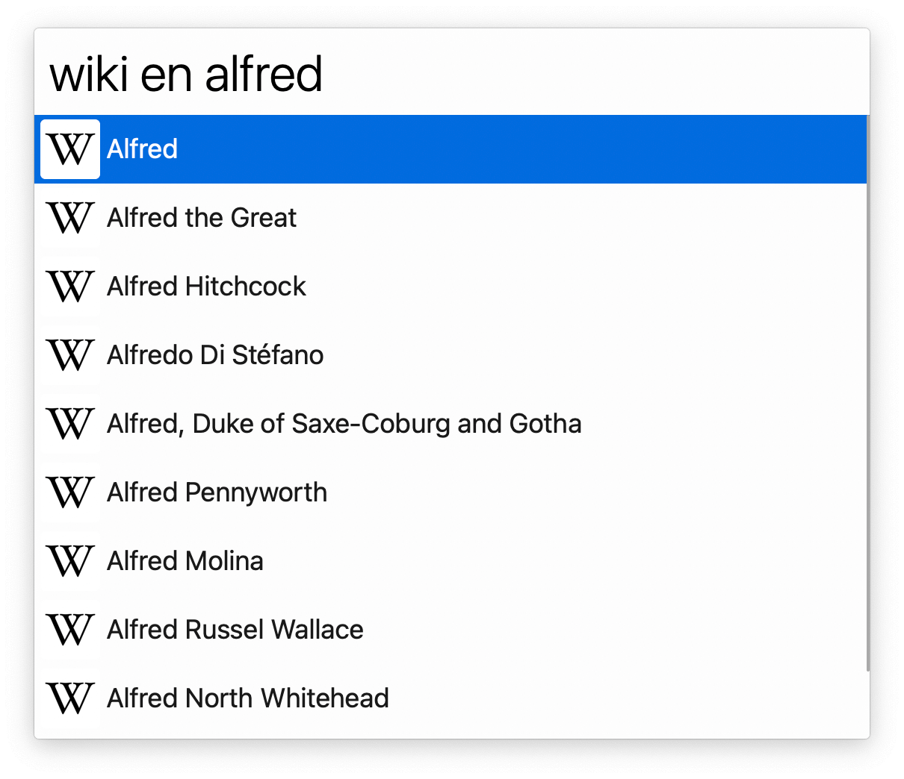
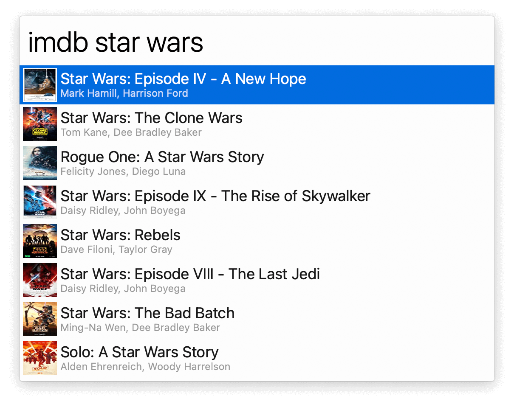

## Usage

Get search suggestions for different web services via the workflow’s keywords:

* `gg` [Google](https://www.google.com).
* `wiki` [Wikipedia](https://www.wikipedia.org). Make the first word the desired language: <code>wiki en Alfred</code> searches the English Wikipedia for “Alfred”.</li>
* `wa` [Wolfram|Alpha](https://www.wolframalpha.com).
* `ama` [Amazon](https://www.amazon.com/).
* `imdb` [IMDB](https://www.imdb.com/).
* `duck` [DuckDuckGo](https://duckduckgo.com).
* `brave` [Brave Search](https://search.brave.com).
* `px` [Pixiv](https://www.pixiv.net/).
* `bd` [Baidu](https://www.baidu.com).
* `zh` [Zhihu](https://www.zhihu.com/).
* `bl` [bilibili](https://search.bilibili.com).
* `tb` [Taobao](https://s.taobao.com/).
* `jd` [JoyBuy](https://search.jd.com).
* `bgm` [Bangumi](http://bgm.tv/). Make the first word the media to search (`all`, `anime`, `book`, `music`, `game`, `real`).
* `moe` [Moegirlpedia](https://zh.moegirl.org.cn).

